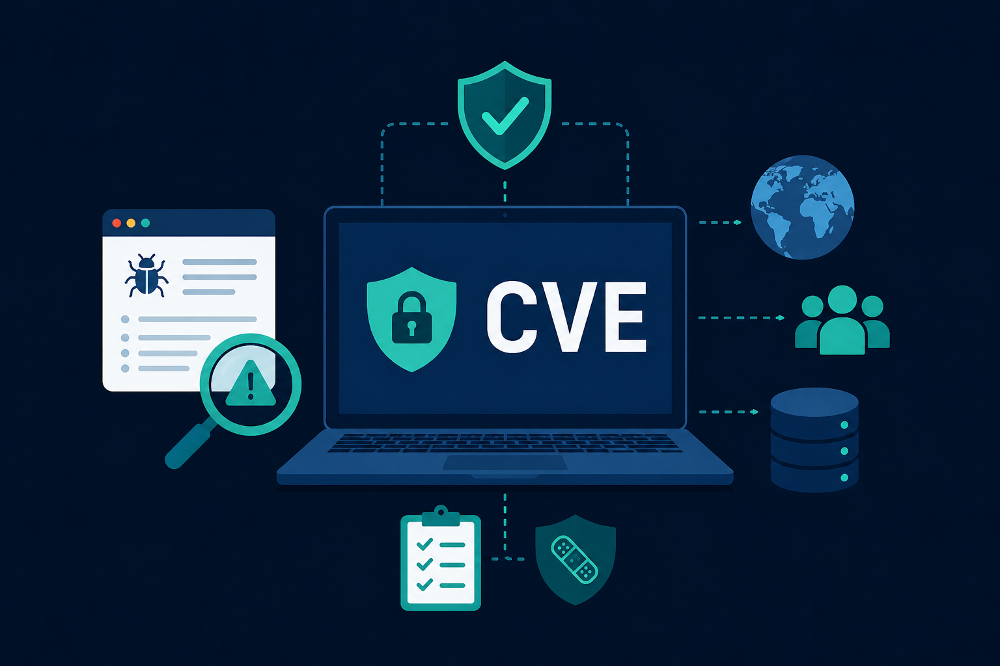

**CVE stands for Common Vulnerabilities and Exposures.**

Its purpose is to give every publicly known cybersecurity vulnerability a **unique and standard name**.

For example:

**CVE-2024-1234**

This works like an ID number for a vulnerability. Instead of different companies, tools, or researchers using different names for the same problem, everyone can refer to the same CVE ID.

### How CVE helps vulnerability management

CVE helps security teams:

- identify known vulnerabilities in software, systems, or devices
- check whether their organization is affected
- track vulnerabilities across tools and reports
- connect a vulnerability to patches, advisories, and fixes
- prioritize which issues need attention first

In simple words, CVE makes vulnerability management more organized.

### How CVE helps information sharing

CVE also helps people share security information clearly.

Vendors, researchers, security teams, scanners, and databases can all use the same CVE ID when talking about the same vulnerability.

So instead of confusion, CVE creates a common language.

### Simple summary

CVE is important because it gives known vulnerabilities a clear public identity. It helps organizations find, discuss, track, and fix security problems more efficiently.
