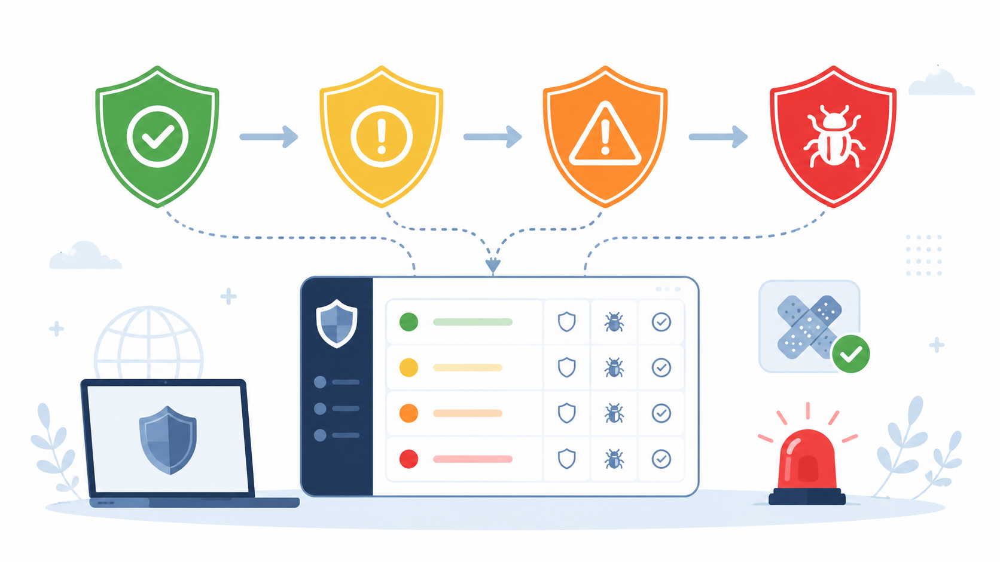

<== [[0. CVE Purpose]] -  [[2. CVE List]] ==>

|  **1**  | **How does the severity of CVEs affect an organization’s prioritization of security measures?**                    |
| :-: | -------------------------------------------------------------------------------------------------------------- |
|  **2**  | **Provide examples of how different severity levels (low, medium, high, critical) influence response strategies.** |

### How does CVE severity affect security prioritization?

The severity of a CVE helps an organization decide **how quickly it should respond**.

Not every vulnerability has the same level of danger. Some bugs are small and difficult to exploit, while others can allow attackers to take control of a system, steal data, or stop services.

So, severity helps security teams answer:

> “Which vulnerability should we fix first?”

Usually, organizations prioritize vulnerabilities based on:

- how serious the impact is
- how easy it is to exploit
- whether the system is exposed to the internet
- whether sensitive data is involved
- whether attackers are already using it

A **critical CVE** usually needs immediate action.  
A **low CVE** may be fixed later during normal maintenance.

---

## Severity levels and response strategies

### Low severity

A low-severity CVE usually has limited impact. It may require special conditions to exploit, or it may not expose important data.

**Example:**  
A minor information leak that shows a software version number.

**Response strategy:**  
The organization can document it, monitor it, and fix it during the next regular update cycle.

---

### Medium severity

A medium-severity CVE is more important, but it may still require user interaction, internal access, or specific conditions.

**Example:**  
A vulnerability that allows limited access only after a user clicks a malicious link.

**Response strategy:**  
The organization should plan a fix, apply patches in a reasonable time, and monitor for suspicious activity.

---

### High severity

A high-severity CVE can cause serious damage, such as unauthorized access, privilege escalation, or data exposure.

**Example:**  
A vulnerability that allows an attacker to access restricted user data.

**Response strategy:**  
The organization should prioritize it quickly, test and apply patches, reduce exposure, and check whether the vulnerability has already been exploited.

---

### Critical severity

A critical CVE is the most dangerous level. It may allow remote code execution, full system compromise, or large-scale data breaches.

**Example:**  
A remote code execution vulnerability in an internet-facing server.

**Response strategy:**  
The organization should respond immediately. This may include emergency patching, isolating affected systems, blocking attack paths, and starting incident response checks.

---

## Simple summary

CVE severity helps organizations decide **what to fix first**.

Low and medium issues can often be handled through normal patching. High and critical issues need faster action because they can create serious security risks. Critical vulnerabilities, especially on internet-facing systems, should be treated as urgent.
