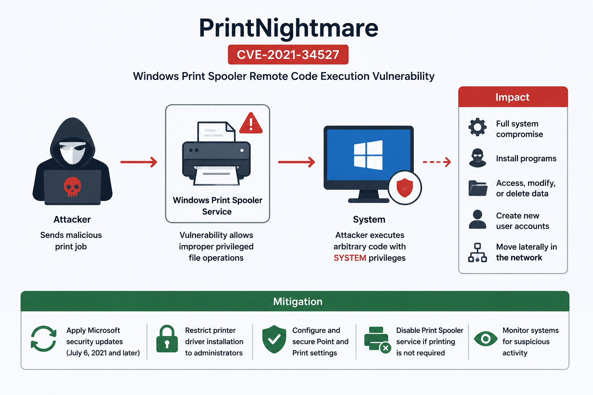

<== [[9. Relationship between CWE, CVE, and CVSS]] - [[11. Analyzing Vulnerability Trends]] ==>

**Objective**: Gain a deeper understanding of a specific vulnerability by reviewing its details and mitigation steps.

**Instructions**:

1. Search for the vulnerability `CVE-2021-34527` on the NVD website.
2. Review the description and impact of the vulnerability.
3. Identify the severity rating and recommended remediation steps.
4. Write a brief summary of the vulnerability and how to mitigate it

## CVE-2021-34527 summary: PrintNightmare

**CVE-2021-34527**, also known as **PrintNightmare**, is a vulnerability in the **Windows Print Spooler** service.

According to the NVD, the vulnerability exists because the Windows Print Spooler service improperly performs privileged file operations. If exploited, an attacker could run arbitrary code with **SYSTEM privileges**, which is one of the highest privilege levels in Windows. This could allow the attacker to install programs, view, change, or delete data, or create new accounts with full user rights.

## Impact

This vulnerability is serious because it affects a core Windows service and can lead to full system compromise.

Possible impacts include:

- remote code execution
- privilege escalation
- unauthorized access to sensitive data
- system takeover
- creation of new privileged accounts
- movement deeper into an organization’s network

In an organization, this could be especially dangerous on **domain controllers, servers, or systems where the Print Spooler service is enabled**.

## Severity rating

The NVD lists this vulnerability with a **CVSS v3.1 base score of 8.8**, which is rated as **High severity**.

Even though the score is “High” rather than “Critical,” the real-world risk can still be very serious because public exploitation and emergency patching made it a major vulnerability management concern.

## Recommended remediation steps

The main remediation is to **install Microsoft security updates released on or after July 6, 2021**. Microsoft states that these updates contain protections for the PrintNightmare vulnerability.

Organizations should also:

- restrict printer driver installation to administrators only
- review and secure **Point and Print** settings
- avoid insecure registry settings related to Point and Print
- disable the Print Spooler service on systems that do not need printing
- prioritize domain controllers and critical servers
- monitor for suspicious print spooler activity

Microsoft recommends installing the latest Windows updates and configuring Point and Print so users receive warning and elevation prompts when installing or updating printer drivers.

## Brief final summary

**CVE-2021-34527, or PrintNightmare, is a Windows Print Spooler remote code execution vulnerability. Successful exploitation can allow an attacker to run code with SYSTEM privileges and potentially take control of affected systems. The vulnerability is rated High severity with a CVSS score of 8.8. To mitigate it, organizations should apply Microsoft’s security updates, restrict printer driver installation to administrators, secure Point and Print settings, and disable Print Spooler where it is not needed.**

For context, this follows the general CVE/CVSS workflow: the CVE identifies the specific vulnerability, and the CVSS score helps estimate its severity and prioritize remediation.
