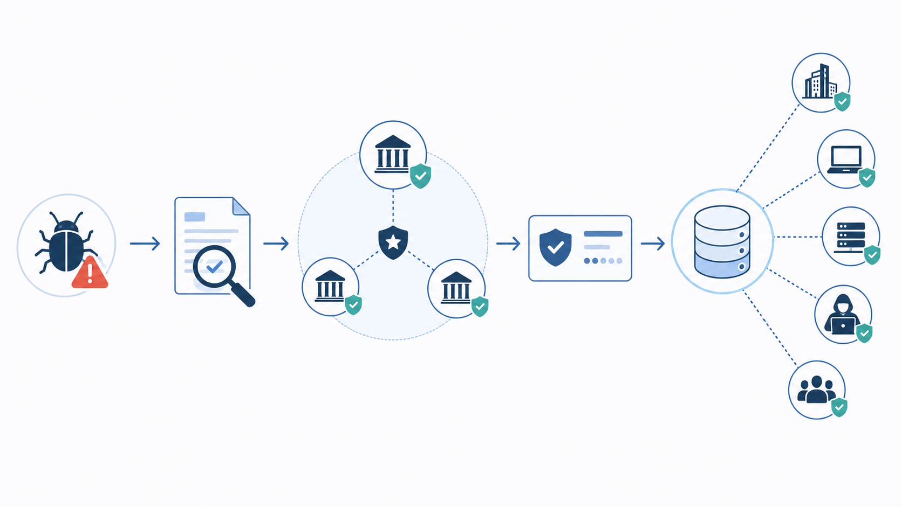

| **1** | **Explain the process of assigning CVE IDs to vulnerabilities.**                                      |
| :---: | ----------------------------------------------------------------------------------------------------- |
| **2** | **Who manages the CVE List, and what role do CVE Numbering Authorities (CNAs) play in this process?** |

## Process of assigning CVE IDs

When a vulnerability is discovered, it can be reported by a researcher, vendor, security team, or user.

The process usually works like this:

1. **A vulnerability is found**  
    Someone discovers a security weakness in software, hardware, or a system.
2. **The issue is reported**  
    The vulnerability is reported to the affected vendor or to a CVE Numbering Authority.
3. **The report is reviewed**  
    The CNA checks whether the issue is real, security-related, and eligible for a CVE ID.
4. **A CVE ID is assigned**  
    If the vulnerability qualifies, the CNA assigns a unique CVE ID, such as `CVE-2026-12345`.
5. **A CVE Record is published**  
    The record includes basic information such as the affected product, a short description, references, and sometimes severity or weakness details.
6. **The information becomes public**  
    Once published, security teams, tools, vendors, and databases can use the CVE ID to track and share information about the vulnerability.

## Who manages the CVE List?

The **CVE Program** manages the CVE List. Its mission is to identify, define, and catalog publicly disclosed cybersecurity vulnerabilities. The CVE Program is sponsored by the U.S. Department of Homeland Security’s Cybersecurity and Infrastructure Security Agency, and it is operated by MITRE. ([CVE](https://www.cve.org/about/overview?utm_source=chatgpt.com "Overview - About the CVE Program"))

## What do CNAs do?

**CNA** stands for **CVE Numbering Authority**.

CNAs are trusted organizations authorized by the CVE Program to assign CVE IDs and publish CVE Records within their own area of responsibility. They can be software vendors, open-source projects, CERT teams, bug bounty providers, researchers, or security organizations. ([CVE](https://www.cve.org/programorganization/cnas?utm_source=chatgpt.com "CVE Numbering Authorities (CNAs)"))

Their role is important because they make the CVE process faster and more organized. Instead of one central body handling every vulnerability in the world, many CNAs handle vulnerabilities related to their own products or scope.

## Simple summary

A CVE ID is assigned when a reported vulnerability is reviewed and accepted as a real public security issue. The CVE Program manages the overall system, while CNAs help by reviewing reports, assigning CVE IDs, and publishing CVE Records for vulnerabilities in their area.
