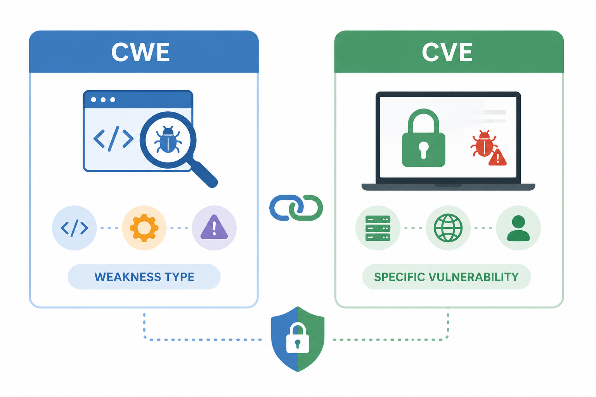

| **Q#1**                                           | **Q#2**                                      |
| --------------------------------------------- | ---------------------------------------- |
| **What is CWE, and how does it differ from CVE?** | **Why are both important in cybersecurity?** |
### What is CWE?

**CWE** stands for **Common Weakness Enumeration**.

It is a list of common software and hardware weaknesses that can lead to security vulnerabilities. A weakness is usually a mistake in design, coding, configuration, or logic.

For example:

- weak password storage
- SQL injection weakness
- poor input validation
- hard-coded credentials
- missing access control

CWE helps developers and security teams understand the **root cause** of security problems. MITRE describes CWE as a community-developed list of software and hardware weaknesses that can become vulnerabilities. ([CWE](https://cwe.mitre.org/?utm_source=chatgpt.com "Common Weakness Enumeration: CWE - MITRE"))

### How is CWE different from CVE?

The easiest way to understand the difference:

|Term|Meaning|Example|
|---|---|---|
|**CWE**|A type of weakness|CWE-89: SQL Injection|
|**CVE**|A specific real-world vulnerability|CVE-2024-XXXX in a specific product|

So, **CWE explains the kind of mistake**, while **CVE identifies the actual vulnerability**.

Example:

A website has a SQL injection bug in its login page.

- The weakness type is **CWE-89: SQL Injection**
    
- The specific vulnerability may be assigned a **CVE ID**
    

The CVE Program’s mission is to identify, define, and catalog publicly disclosed cybersecurity vulnerabilities. ([CVE](https://www.cve.org/?utm_source=chatgpt.com "CVE: Common Vulnerabilities and Exposures"))

### Why are both important?

Both are important because they help at different stages of cybersecurity.

**CVE helps security teams react.**  
It tells them that a specific product or system has a known vulnerability that may need patching.

**CWE helps teams prevent.**  
It shows the common weakness behind the vulnerability, so developers can fix bad patterns in code and avoid repeating the same mistake.

In simple words:

> **CVE tells us what vulnerability exists. CWE tells us why that kind of vulnerability happens.**

Together, they help organizations not only fix known security issues, but also improve software quality and reduce future risks.
