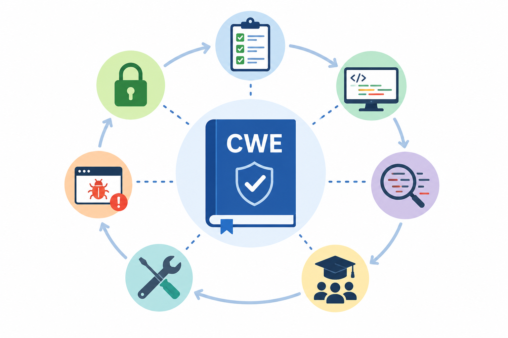

| **1**   | **Describe the role of CWE in secure software development practices.**    |
| --- | --------------------------------------------------------------------- |
| **2**   | **How can developers leverage CWE to improve code quality and security?** |

## 6. Role of CWE

### Role of CWE in secure software development

**CWE** helps developers understand the common mistakes that create security problems in software.

It gives names and categories to weaknesses such as:

- poor input validation
- SQL injection
- weak authentication
- hard-coded passwords
- missing access control
- insecure use of cryptography

In secure software development, CWE is useful because it helps teams focus on the **root cause** of vulnerabilities, not only the final bug.

For example, if a product has many vulnerabilities related to input validation, CWE helps the team see the pattern and improve how they write and review code.

### How developers can use CWE

Developers can use CWE to improve code quality and security in several practical ways.

They can use it during **design** to avoid risky architecture decisions.

They can use it during **coding** as a checklist of common mistakes to avoid.

They can use it during **code review** to ask better security questions, such as:

> “Are we validating user input properly?”  
> “Are we checking authorization before allowing this action?”  
> “Are we storing secrets safely?”

They can also use CWE with static analysis tools, security testing tools, and training programs. Many tools map their findings to CWE IDs, which helps developers understand what type of weakness exists and how to fix it.

### Simple summary

CWE helps developers write safer software by showing the common weakness patterns that lead to vulnerabilities. It improves code quality by turning security problems into clear categories that teams can learn from, detect earlier, and prevent in future development.
