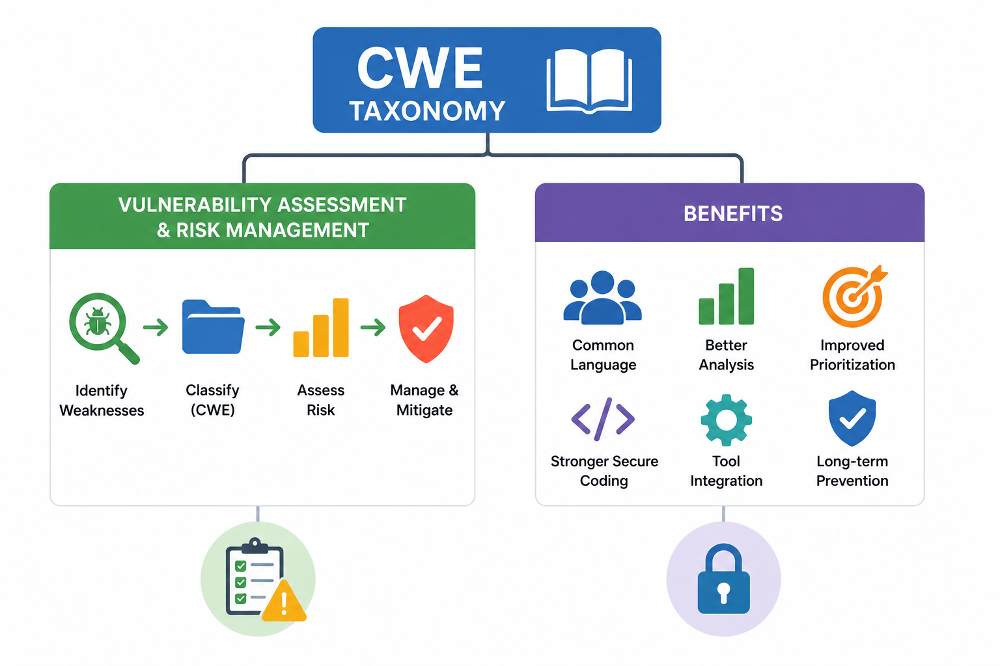

| **1** | **Explain how CWE taxonomy helps in vulnerability assessment and risk management.** |
| :---: | ----------------------------------------------------------------------------------- |
| **2** | **What are the benefits of using a standardized classification system like CWE**    |

### How CWE taxonomy helps in vulnerability assessment and risk management

**CWE taxonomy** organizes software and hardware weaknesses into clear categories.

This helps security teams understand not only **what went wrong**, but also **what type of weakness caused the problem**.

For example, instead of saying:

> “There is a bug in the login system”

CWE helps classify it more clearly as:

> **Improper Authentication**  
> **Missing Authorization**  
> **Hard-coded Credentials**

This makes vulnerability assessment easier because teams can group similar weaknesses, find patterns, and understand which areas of the software are most risky.

In risk management, CWE helps organizations:

- identify repeated weakness patterns
- understand root causes
- connect vulnerabilities to secure coding practices
- prioritize dangerous weakness types
- improve training for developers
- reduce future vulnerabilities

CWE is especially useful because it gives teams a common language for discussing weaknesses in code, design, and architecture. ([NVD](https://nvd.nist.gov/vuln/categories?utm_source=chatgpt.com "NVD CWE Slice"))

### Benefits of using a standardized classification system like CWE

A standardized system like CWE is useful because everyone uses the same terms.

This helps developers, testers, security teams, managers, and tools communicate more clearly.

Main benefits include:

|Benefit|Meaning|
|---|---|
|**Clear communication**|Teams can describe weaknesses using the same names and IDs.|
|**Better analysis**|Security teams can group similar issues and identify common patterns.|
|**Improved prioritization**|Teams can focus on weaknesses that create the highest risk.|
|**Stronger secure coding**|Developers can learn which mistakes to avoid.|
|**Tool integration**|Static analysis, scanners, and vulnerability platforms can map findings to CWE IDs.|
|**Long-term prevention**|Teams can fix the root causes, not only individual bugs.|

### Simple summary

CWE taxonomy helps organizations classify weaknesses in a structured way. It improves vulnerability assessment by showing the type and root cause of security issues. It also supports risk management by helping teams prioritize, prevent, and communicate weaknesses more effectively.
