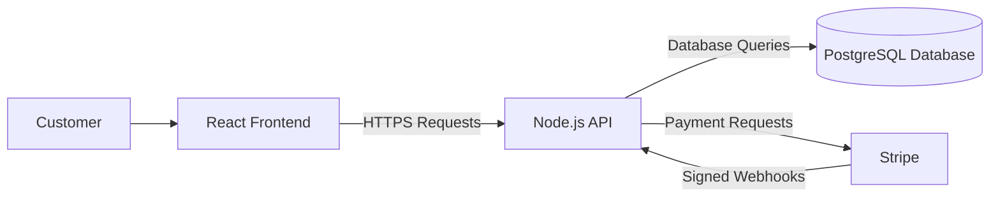
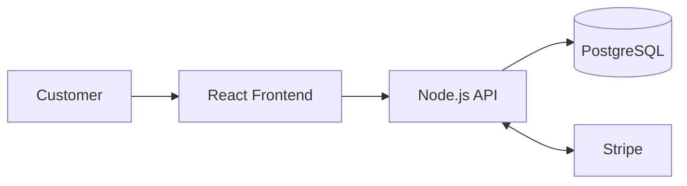
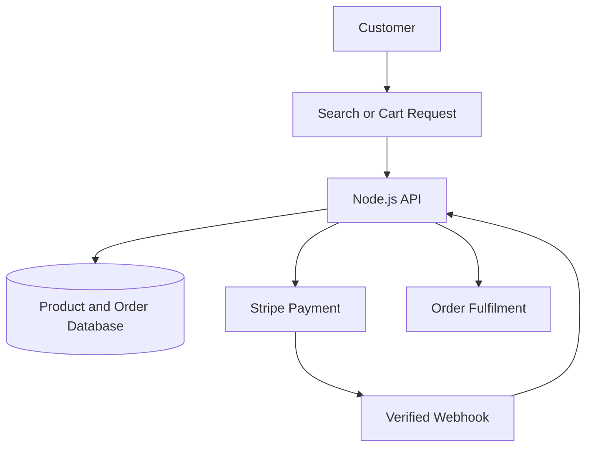
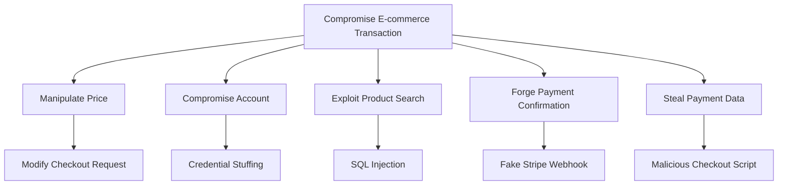

# Threat Model

> **System/Asset:** E-commerce Platform  
> **Date:** June 22, 2026  
> **Modeler:** [Mahdi Hamidi]  
> **Version:** 1.0

---

## System Overview

### System Description

The e-commerce platform allows users to:

- Browse products without authentication
- Add products to a cart without authentication
- Checkout and pay after authentication
- View order history after authentication

The platform uses:

- React frontend
- Node.js REST API
- PostgreSQL database
- Stripe payment integration

### System Architecture



### System Boundaries

**Included:**

- React frontend
- Node.js API
- Authentication and authorization
- Cart and checkout logic
- Product search
- PostgreSQL database
- Stripe integration

**Excluded:**

- Stripe's internal infrastructure
- Customer-owned devices
- Banking systems outside Stripe
- Physical hosting infrastructure

### Trust Boundaries

1. **Customer browser → Node.js API:** User-controlled data enters the trusted backend.
2. **Node.js API → PostgreSQL:** Application requests access protected business and customer data.
3. **Node.js API → Stripe:** Payment information crosses into an external provider.
4. **Stripe webhook → Node.js API:** Public webhook requests must be verified before trust.

---

## Asset Identification

### Critical Assets

|Asset ID|Asset Name|Description|Criticality|Value|
|---|---|---|---|---|
|A001|Customer Data|Names, addresses, account details, and order history|Critical|Privacy|
|A002|Product and Price Data|Authoritative product prices and inventory|Critical|Financial|
|A003|Orders|Purchased products, quantities, totals, and status|Critical|Financial|
|A004|Authentication Data|Password hashes, sessions, and tokens|Critical|Security|
|A005|Payment References|Stripe payment IDs, status, amount, and currency|Critical|Financial|
|A006|Audit Logs|Records of login, checkout, and payment activity|High|Operational|

---

## Threat Analysis Using STRIDE

### STRIDE Overview

STRIDE identifies six threat categories:

- Spoofing
- Tampering
- Repudiation
- Information Disclosure
- Denial of Service
- Elevation of Privilege

### Threat Identification

|   |   |   |   |   |   |   |
|---|---|---|---|---|---|---|
|STRIDE Category|Threat Description|Threat Scenario|Affected Assets|Likelihood|Impact|Risk Level|
|**Spoofing**|Attacker impersonates a customer|Stolen credentials are used to access an account|A001, A003, A004|Medium–High|High|High|
|**Tampering**|Attacker changes checkout price|Product price is modified in the browser request|A002, A003, A005|High|Critical|Critical|
|**Repudiation**|Customer denies placing an order|Incomplete logs cannot prove account activity|A003, A006|Medium|Medium|Medium|
|**Information Disclosure**|Payment or customer data is exposed|Sensitive data appears in logs or insecure forms|A001, A005|Medium|Critical|High|
|**Denial of Service**|Checkout or search becomes unavailable|Automated requests exhaust API resources|A002, A003|Medium|High|High|
|**Elevation of Privilege**|Customer accesses administrative functions|Broken authorization permits privileged actions|A001, A002, A003|Low–Medium|Critical|High|

---

## Detailed Threat Scenarios

### Threat 1: Checkout Price Tampering

**STRIDE Category:** Tampering

**Threat Description:**

An attacker changes product prices, discounts, quantities, or totals in the checkout request.

**Threat Scenario:**

1. A laptop costs €500.
2. The attacker intercepts the checkout request.
3. They change the submitted price from €500 to €5.
4. The backend trusts the frontend value.
5. Stripe charges €5 and the order is accepted.

**Affected Assets:**

- Asset A002: Product and price data
- Asset A003: Orders
- Asset A005: Payment references

**Attack Vector:**

- Browser developer tools
- Intercepting proxy
- Modified API request
- Missing server-side price calculation

**Likelihood:**

- **Qualitative:** High
- **Reasoning:** Users fully control their browsers and outgoing requests.

**Impact:**

- **Confidentiality:** Negligible
- **Integrity:** Critical
- **Availability:** Low
- **Overall:** Critical
- **Reasoning:** Incorrect prices can cause direct financial and inventory loss.

**Risk Level:** Critical

**Existing Controls:**

- User authentication
- HTTPS

**Mitigation Recommendations:**

- Ignore prices and totals sent by the frontend.
- Retrieve current prices from PostgreSQL.
- Calculate tax, discount, shipping, and total in the backend.
- Send only the server-calculated amount to Stripe.
- Compare payment amount and currency before fulfilment.

---

### Threat 2: Customer Account Takeover

**STRIDE Category:** Spoofing

**Threat Description:**

An attacker accesses a customer account using stolen credentials or a stolen session token.

**Threat Scenario:**

1. A customer reuses a password exposed in another breach.
2. The attacker performs credential stuffing.
3. The attacker logs in successfully.
4. They view order history or change delivery information.
5. Fraudulent orders are placed.

**Affected Assets:**

- Asset A001: Customer data
- Asset A003: Orders
- Asset A004: Authentication data

**Attack Vector:**

- Credential stuffing
- Phishing
- Session theft
- Weak password controls

**Likelihood:**

- **Qualitative:** Medium–High
- **Reasoning:** Reused passwords and automated login tools are common.

**Impact:**

- **Confidentiality:** High
- **Integrity:** High
- **Availability:** Low
- **Overall:** High
- **Reasoning:** The attacker may expose personal data and perform unauthorized transactions.

**Risk Level:** High

**Existing Controls:**

- Password authentication
- Session cookies

**Mitigation Recommendations:**

- Use Argon2id or properly configured bcrypt.
- Add login rate limiting.
- Detect credential-stuffing behaviour.
- Use secure session cookies.
- Rotate sessions after login.
- Offer MFA.
- Require reauthentication for sensitive account changes.

---

### Threat 3: Payment Information Exposure

**STRIDE Category:** Information Disclosure

**Threat Description:**

Payment or personal information is exposed through insecure payment fields, logs, scripts, or leaked Stripe credentials.

**Threat Scenario:**

1. A custom checkout form collects card information.
2. A third-party JavaScript dependency is compromised.
3. The script reads payment information.
4. Data is sent to an attacker-controlled server.
5. The legitimate payment continues normally.

**Affected Assets:**

- Asset A001: Customer data
- Asset A005: Payment references
- Asset A004: Authentication data

**Attack Vector:**

- Malicious frontend script
- Sensitive logging
- Exposed Stripe secret key
- Insecure transport

**Likelihood:**

- **Qualitative:** Medium
- **Reasoning:** Risk increases when custom payment fields or many third-party scripts are used.

**Impact:**

- **Confidentiality:** Critical
- **Integrity:** Medium
- **Availability:** Low
- **Overall:** Critical
- **Reasoning:** Payment-data exposure may cause fraud, legal penalties, and reputational damage.

**Risk Level:** High

**Existing Controls:**

- HTTPS
- Stripe payment integration

**Mitigation Recommendations:**

- Use Stripe Checkout or Stripe Elements.
- Keep Stripe secret keys only on the backend.
- Do not log payment details or tokens.
- Minimize third-party checkout scripts.
- Apply a Content Security Policy.
- Verify Stripe webhook signatures.

---

## Vulnerability Analysis

### Identified Vulnerabilities

|   |   |   |   |   |   |
|---|---|---|---|---|---|
|Vuln ID|Vulnerability|Type|Exploitability|Severity|Related Threats|
|V001|Client-supplied price trusted|Business logic|High|Critical|Price tampering|
|V002|Unsafe SQL query construction|Injection|High|Critical|SQL injection|
|V003|Weak session handling|Session management|High|High|Account takeover|
|V004|Missing object-level authorization|Authorization|High|Critical|Order-history exposure|
|V005|Unverified Stripe webhooks|Integration|Medium|Critical|Fake payment confirmation|
|V006|Sensitive data logged|Data protection|Medium|High|Payment-data exposure|

---

## Attack Surface Analysis

### Entry Points

|   |   |   |   |   |
|---|---|---|---|---|
|Entry Point|Description|Authentication Required|Access Level|Threats|
|EP001|Product-search endpoint|No|Public|SQL injection, DoS|
|EP002|Login endpoint|No|Public|Credential stuffing|
|EP003|Cart API|No|Public|Parameter tampering|
|EP004|Checkout API|Yes|Customer|Price manipulation|
|EP005|Order-history API|Yes|Customer|Broken authorization|
|EP006|Stripe webhook|No, signature required|Public system endpoint|Forged payment events|
|EP007|Administrative API|Yes|Privileged|Elevation of privilege|

### Data Flows

1. The customer sends search, cart, login, and checkout requests to the API.
2. The API reads product prices and inventory from PostgreSQL.
3. The backend calculates the order total.
4. The API creates a payment through Stripe.
5. Stripe returns payment status through a signed webhook.
6. The backend updates the order after validating the payment.
7. Order and customer information is stored in PostgreSQL.

---

## Risk Assessment

### Risk Summary

|   |   |   |   |   |   |   |
|---|---|---|---|---|---|---|
|Risk ID|Threat|Vulnerability|Likelihood|Impact|Risk Level|Priority|
|R001|Checkout price tampering|V001|High|Critical|Critical|1|
|R002|SQL injection|V002|High|Critical|Critical|1|
|R003|Account takeover|V003|Medium–High|High|High|2|
|R004|Unauthorized order access|V004|High|Critical|Critical|1|
|R005|Forged Stripe confirmation|V005|Medium|Critical|Critical|1|
|R006|Payment-data disclosure|V006|Medium|Critical|High|2|

### Risk Matrix

|   |   |   |   |
|---|---|---|---|
|Impact \ Likelihood|Low|Medium|High|
|**Critical**|High|Critical|Critical|
|**High**|Medium|High|High|
|**Medium**|Low|Medium|High|

---

## Mitigation Strategies

### Recommended Controls

|   |   |   |   |   |   |   |
|---|---|---|---|---|---|---|
|Control ID|Control Name|Control Type|Mitigates|Implementation Priority|Cost|Effectiveness|
|C001|Server-side price calculation|Preventive|Price tampering|Immediate|Low|Critical|
|C002|Parameterized SQL queries|Preventive|SQL injection|Immediate|Low|Critical|
|C003|MFA and secure sessions|Preventive|Account takeover|Immediate|Medium|High|
|C004|Object-level authorization|Preventive|Unauthorized order access|Immediate|Medium|Critical|
|C005|Stripe webhook verification|Preventive|Fake payment status|Immediate|Low–Medium|Critical|
|C006|Least-privilege database access|Preventive|Database compromise|Immediate|Low|High|
|C007|Secure logging|Preventive/Detective|Sensitive-data exposure|Short-term|Low|High|
|C008|Rate limiting and monitoring|Preventive/Detective|Abuse and DoS|Short-term|Medium|High|

### Defense-in-Depth Layers

|   |   |   |
|---|---|---|
|Layer|Controls|Effectiveness|
|Physical|Secure cloud and data-centre access|Medium|
|Network|HTTPS, segmentation, rate limiting|High|
|Host|Server hardening, patching, monitoring|High|
|Application|Authentication, authorization, validation|Critical|
|Data|Encryption, least privilege, backups|Critical|
|Policies/Procedures|Incident response, secure development, access reviews|High|

---

## DREAD Analysis

### DREAD Scoring

|   |   |   |   |   |   |   |   |
|---|---|---|---|---|---|---|---|
|Threat|Damage|Reproducibility|Exploitability|Affected Users|Discoverability|Total Score|Risk Level|
|SQL injection in product search|9|9|8|9|10|45|Critical|
|Checkout price tampering|9|9|9|7|9|43|Critical|
|Account takeover|8|8|7|6|7|36|High|

### SQL Injection Calculation

```
DREAD Score =
(Damage + Reproducibility + Exploitability
+ Affected Users + Discoverability) / 5
```

```
SQL Injection = (9 + 9 + 8 + 9 + 10) / 5
SQL Injection = 45 / 5
SQL Injection = 9.0 / 10
```

**Risk Rating:** Critical

---

## Diagrams

### System Architecture Diagram



### Data Flow Diagram



### Attack Tree



---

## Recommendations

### Immediate Actions

- Replace dynamic SQL with parameterized queries.
- Calculate all prices and totals on the backend.
- Verify Stripe webhook signatures.
- Apply object-level authorization.
- Restrict database permissions.
- Protect sessions and authentication.

### Short-Term Actions

- Add rate limiting and credential-stuffing detection.
- Use Stripe-hosted payment components.
- Add automated authorization and tampering tests.
- Remove sensitive data from logs.
- Add monitoring for unusual checkout activity.

### Long-Term Actions

- Conduct regular penetration testing.
- Improve fraud detection.
- Review third-party frontend dependencies.
- Maintain secure development standards.
- Test backup and incident-response procedures.

---

## Review and Update

**Next Review Date:** December 22, 2026

**Review Triggers:**

- Checkout or payment changes
- New APIs or integrations
- Security incidents
- Major architecture changes
- New vulnerabilities
- Changes to authentication or authorization

---

## References

- OWASP, **Threat Modeling Cheat Sheet**
- OWASP, **SQL Injection Prevention Cheat Sheet**
- OWASP, **Authentication Cheat Sheet**
- OWASP, **Authorization Cheat Sheet**
- OWASP, **Session Management Cheat Sheet**
- Stripe, **Webhook Security Guidance**
- Stripe, **Server-Side Payment Processing Guidance**

---

_This threat model should be reviewed and updated when the system changes or new threats are identified._
