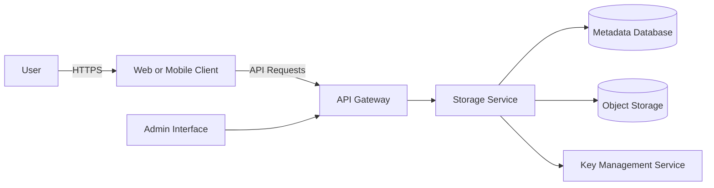
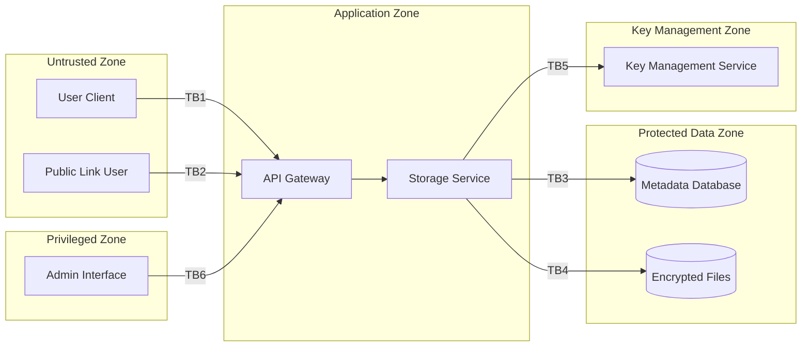
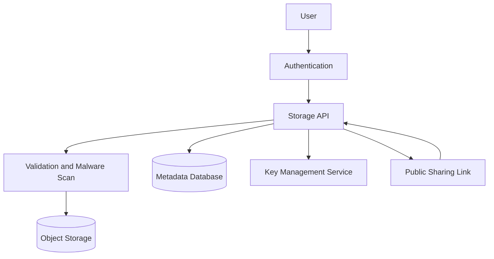
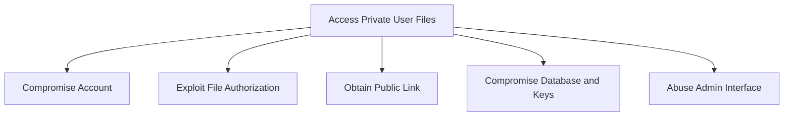

# Threat Model

> **System/Asset:** Cloud Storage Service  
> **Date:** June 22, 2026  
> **Modeler:** [Mahdi Hamidi]  
> **Version:** 1.0

---

## System Overview

### System Description

The cloud storage service provides:

- File upload and download
- File sharing
- Public link generation
- File versioning
- Client-side and server-side encryption

### System Architecture



### System Boundaries

**Included:**

- Authentication
- File upload and download APIs
- File sharing
- Public links
- Metadata database
- Object storage
- Encryption and key management
- Administration interface

**Excluded:**

- User-owned devices
- Cloud-provider physical infrastructure
- External identity-provider infrastructure

### Trust Boundaries



---

## Asset Identification

### Critical Assets

|Asset ID|Asset Name|Description|Criticality|Value|
|---|---|---|---|---|
|A001|User Files|Private and shared uploaded files|Critical|Confidentiality|
|A002|Encryption Keys|Keys used to encrypt and decrypt files|Critical|Security|
|A003|Authentication Data|Passwords, MFA data, tokens, and sessions|Critical|Security|
|A004|Sharing Permissions|File ownership and access rules|Critical|Authorization|
|A005|File Metadata|Names, owners, versions, and link information|High|Privacy|
|A006|Audit Logs|Records of access, sharing, and administration|High|Accountability|

---

## Threat Analysis Using STRIDE

### STRIDE Overview

STRIDE covers:

- Spoofing
- Tampering
- Repudiation
- Information Disclosure
- Denial of Service
- Elevation of Privilege

### Threat Identification

|   |   |   |   |   |   |   |
|---|---|---|---|---|---|---|
|STRIDE Category|Threat Description|Threat Scenario|Affected Assets|Likelihood|Impact|Risk Level|
|**Spoofing**|Account takeover|Stolen credentials provide access to stored files|A001, A003|4|5|Critical|
|**Tampering**|Encryption keys are modified|Attacker replaces or deletes encryption keys|A001, A002|3|5|High|
|**Repudiation**|User denies sharing a file|Incomplete logs cannot confirm the action|A004, A006|3|3|Medium|
|**Information Disclosure**|Files and keys are stolen together|Database compromise exposes encrypted data and keys|A001, A002|4|5|Critical|
|**Denial of Service**|Upload abuse exhausts storage|Automated uploads consume storage and processing resources|A001|4|4|High|
|**Elevation of Privilege**|User accesses admin functions|Broken authorization exposes privileged APIs|A001, A004|3|5|High|

---

## Detailed Threat Scenarios

### Threat 1: Malicious File Upload

**STRIDE Category:** Tampering

**Threat Description:**

An attacker uploads malware, scripts, or oversized files.

**Threat Scenario:**

1. The attacker creates an account.
2. A malicious file is uploaded.
3. The service does not validate or scan it.
4. The file is shared with another user.
5. The recipient downloads and opens it.

**Affected Assets:**

- A001: User Files
- A006: Audit Logs

**Impact:**

- Malware distribution
- Storage exhaustion
- User compromise
- Reputation damage

**Likelihood:** High

**Mitigation:**

- Allowlist permitted file types.
- Validate file extension and file content.
- Scan uploaded files for malware.
- Apply file-size and storage quotas.
- Store files outside executable application directories.

---

### Threat 2: Broken File-Sharing Authorization

**STRIDE Category:** Information Disclosure

**Threat Description:**

A user accesses another user's file by changing a file identifier.

**Threat Scenario:**

1. A user requests `/api/files/1001`.
2. The identifier is changed to `/api/files/1002`.
3. The API verifies authentication but not ownership.
4. Another user's private file is returned.

**Affected Assets:**

- A001: User Files
- A004: Sharing Permissions

**Impact:**

- Private file disclosure
- Privacy violations
- Regulatory consequences

**Likelihood:** High

**Mitigation:**

- Check file ownership on every request.
- Validate sharing permissions on the server.
- Use short-lived signed download URLs.
- Log failed authorization attempts.
- Test object-level authorization.

---

### Threat 3: Public-Link Leakage

**STRIDE Category:** Information Disclosure

**Threat Description:**

A public link is guessed, forwarded, indexed, or exposed.

**Threat Scenario:**

1. A user creates a permanent public link.
2. The link appears in browser history or is forwarded.
3. An unauthorized person opens it.
4. The file remains available without authentication.

**Affected Assets:**

- A001: User Files
- A004: Sharing Permissions
- A005: File Metadata

**Impact:**

- Confidential data exposure
- Loss of control over shared files

**Likelihood:** High

**Mitigation:**

- Use random, high-entropy link tokens.
- Support expiration dates.
- Allow password-protected links.
- Allow immediate link revocation.
- Disable search-engine indexing.

---

### Threat 4: Encryption Keys Stored with Encrypted Data

**STRIDE Category:** Information Disclosure and Tampering

**Threat Description:**

Encryption keys are stored in the same database as encrypted files or file metadata.

**Threat Scenario:**

1. An attacker compromises the database.
2. The attacker obtains encrypted files and encryption keys.
3. The attacker decrypts user files.
4. Keys may also be modified or deleted.
5. Files become exposed or permanently inaccessible.

**Affected Assets:**

- A001: User Files
- A002: Encryption Keys
- A005: File Metadata

**Impact:**

- Complete loss of confidentiality
- Loss of file integrity
- Permanent data loss
- Encryption becomes ineffective

**Likelihood:** Medium to High

**Mitigation:**

- Store keys in a separate KMS or HSM.
- Use envelope encryption.
- Separate access permissions for keys and data.
- Rotate encryption keys.
- Log every key operation.
- Never store plaintext master keys in the database.

---

### Threat 5: Account Takeover

**STRIDE Category:** Spoofing

**Threat Description:**

An attacker gains access using stolen credentials or sessions.

**Threat Scenario:**

1. Credentials are stolen through phishing.
2. The attacker logs in.
3. Files are downloaded or publicly shared.
4. Existing file versions may be deleted.

**Affected Assets:**

- A001: User Files
- A003: Authentication Data
- A004: Sharing Permissions

**Impact:**

- File theft
- Unauthorized sharing
- File deletion
- Privacy breach

**Likelihood:** High

**Mitigation:**

- Require MFA.
- Rate-limit login attempts.
- Detect credential stuffing.
- Use secure, short-lived sessions.
- Reauthenticate before deleting files or changing encryption settings.

---

## Vulnerability Analysis

### Identified Vulnerabilities

|   |   |   |   |   |   |
|---|---|---|---|---|---|
|Vuln ID|Vulnerability|Type|Exploitability|Severity|Related Threats|
|V001|Weak upload validation|Input validation|High|High|Malicious upload|
|V002|Broken object authorization|Authorization|High|Critical|File disclosure|
|V003|Long-lived public links|Access control|High|High|Link leakage|
|V004|Keys stored with encrypted data|Key management|Medium|Critical|Key disclosure|
|V005|Weak authentication|Authentication|High|Critical|Account takeover|
|V006|Missing upload quotas|Resource control|High|High|Denial of service|

---

## Attack Surface Analysis

### Entry Points

|   |   |   |   |   |
|---|---|---|---|---|
|Rank|Entry Point|Description|Authentication Required|Risk Level|
|1|File upload endpoint|Accepts user-controlled files|Yes|Critical|
|2|File download and sharing API|Returns files using object IDs|Yes|Critical|
|3|Public links|Allows unauthenticated file access|No|Critical|
|4|Authentication flow|Creates user sessions|No|High|
|5|Encryption-key interface|Retrieves or manages keys|Service or Admin|Critical|
|6|Admin interface|Manages users and files|Admin|Critical|
|7|REST API|Handles files, versions, and permissions|Yes|High|
|8|File-version endpoint|Restores or deletes versions|Yes|High|
|9|Integration endpoints|Receives external events|Varies|Medium|
|10|Password-reset flow|Recovers accounts|No|High|

### Data Flows



---

## Risk Assessment

### Risk Formula

**Risk Score = Likelihood × Impact**

Both likelihood and impact use a scale from 1 to 5.

### Risk Summary

|   |   |   |   |   |   |   |
|---|---|---|---|---|---|---|
|Risk ID|Threat|Likelihood|Impact|Calculation|Risk Score|Risk Level|
|R001|Broken file authorization|5|5|5 × 5|25|Critical|
|R002|Keys stored with encrypted data|4|5|4 × 5|20|Critical|
|R003|Malicious file upload|4|4|4 × 4|16|High|
|R004|Account takeover|4|5|4 × 5|20|Critical|
|R005|Public-link leakage|4|4|4 × 4|16|High|

### Risk Scale

|   |   |
|---|---|
|Score|Risk Level|
|1–4|Low|
|5–9|Medium|
|10–16|High|
|17–25|Critical|

### Risk Matrix

|   |   |   |   |   |   |
|---|---|---|---|---|---|
|Impact / Likelihood|1|2|3|4|5|
|**5 — Critical**|5|10|15|**20: R002, R004**|**25: R001**|
|**4 — High**|4|8|12|**16: R003, R005**|20|
|**3 — Medium**|3|6|9|12|15|
|**2 — Low**|2|4|6|8|10|
|**1 — Minimal**|1|2|3|4|5|

---

## Mitigation Strategies

### Recommended Controls

|   |   |   |   |   |   |
|---|---|---|---|---|---|
|Control ID|Control Name|Mitigates|Priority|Cost|Effectiveness|
|C001|Object-level authorization|R001|Immediate|Medium|Critical|
|C002|Separate KMS or HSM|R002|Immediate|Medium|Critical|
|C003|File validation and malware scanning|R003|Immediate|Medium|High|
|C004|MFA and secure sessions|R004|Immediate|Medium|High|
|C005|Expiring public links|R005|Immediate|Low|High|
|C006|Upload quotas and rate limits|Upload DoS|Short-term|Low|High|
|C007|Immutable audit logs|Repudiation|Short-term|Medium|High|

### Defense-in-Depth Layers

|   |   |   |
|---|---|---|
|Layer|Controls|Effectiveness|
|Network|TLS, rate limiting, API gateway|High|
|Host|Hardening, patching, malware scanning|High|
|Application|Authentication, authorization, upload validation|Critical|
|Data|Encryption, separate KMS, backups|Critical|
|Policies|Access reviews, incident response, key rotation|High|

---

## DREAD Analysis

### DREAD Formula

**DREAD Average = (Damage + Reproducibility + Exploitability + Affected Users + Discoverability) / 5**

### DREAD Scoring

|   |   |   |   |   |   |   |   |
|---|---|---|---|---|---|---|---|
|Threat|Damage|Reproducibility|Exploitability|Affected Users|Discoverability|Total|Average|
|Broken file authorization|9|9|8|9|9|44|8.8|
|Keys stored with encrypted data|10|8|7|10|6|41|8.2|
|Malicious file upload|8|9|8|7|9|41|8.2|
|Account takeover|9|8|8|7|8|40|8.0|
|Public-link leakage|8|9|8|7|10|42|8.4|

### Example DREAD Calculation

**Broken file authorization:**

```
DREAD Average = (9 + 9 + 8 + 9 + 9) / 5
DREAD Average = 44 / 5
DREAD Average = 8.8
```

**Risk Level:** Critical

---

## Diagrams

### Attack Tree



---

## Recommendations

### Immediate Actions

- Enforce object-level authorization.
- Move encryption keys to a separate KMS or HSM.
- Enable MFA.
- Validate and scan uploaded files.
- Add expiration and revocation to public links.

### Short-Term Actions

- Add storage quotas and rate limits.
- Review administrator permissions.
- Add immutable audit logging.
- Test file-sharing and download APIs.

### Long-Term Actions

- Rotate encryption keys regularly.
- Conduct penetration testing.
- Monitor unusual downloads and sharing.
- Review third-party integrations.

---

## Review and Update

**Next Review Date:** December 22, 2026

**Review Triggers:**

- New file-sharing features
- Encryption changes
- Security incidents
- New APIs
- Cloud architecture changes

---

## References

- OWASP, **File Upload Cheat Sheet**
- OWASP, **API Security Top 10**
- OWASP, **Cryptographic Storage Cheat Sheet**
- OWASP, **Key Management Cheat Sheet**
- NIST, **SP 800-57: Recommendation for Key Management**

---

_This threat model should be reviewed when the system changes or new threats are identified._