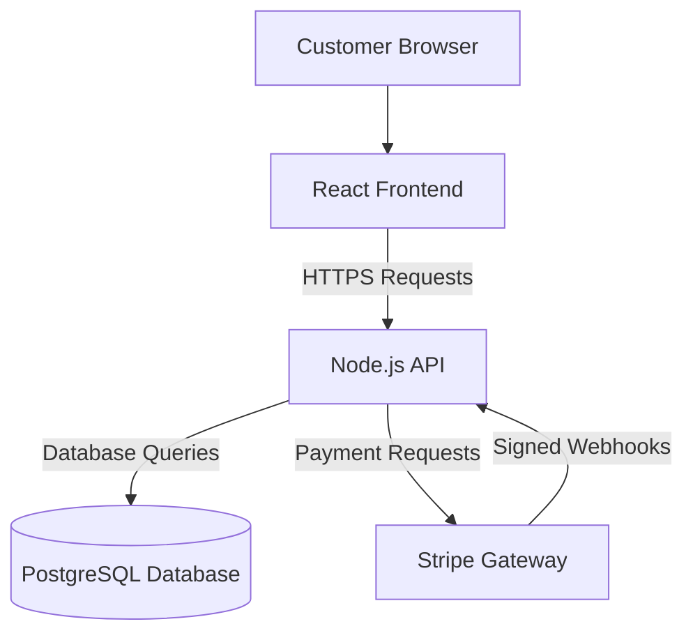

# Threat Model: E-commerce Platform

## 1. System Overview

The e-commerce platform includes:

- React frontend
- Node.js API backend
- PostgreSQL database
- Stripe payment service


Users can browse products and add items to their cart without authentication. They must log in to complete payment and view their order history.

---

## 2. Architecture Diagram



The customer browser is considered untrusted. The backend must validate all information received from it.

---

# 3. STRIDE Threats During Checkout

## Threat 1: Price Manipulation

**STRIDE category:** Tampering

### Description

An attacker modifies the product price, discount, quantity, or total amount inside the checkout request.

### Attack scenario

A laptop costs €500, but the attacker changes the request and submits a price of €5. If the backend trusts the frontend value, Stripe may charge the incorrect amount.

### Impact

- Financial loss
- Fraudulent purchases
- Inventory loss
- Incorrect accounting records


### Likelihood

**High**, because users fully control their browsers and can modify requests using browser tools or an intercepting proxy.

### Mitigation

- Never trust prices sent by the frontend.
- Allow the frontend to send only product IDs and quantities.
- Retrieve the real product price from PostgreSQL.
- Calculate discounts, taxes, shipping, and totals in the backend.
- Send only the server-calculated amount to Stripe.
- Compare the Stripe payment amount with the stored order total before shipping.


---

## Threat 2: Customer Account Takeover

**STRIDE category:** Spoofing

### Description

An attacker impersonates a legitimate customer using stolen credentials or a stolen session cookie.

### Attack scenario

A customer reuses a password that was exposed in another data breach. An attacker uses that password to log in, view the customer's order history, change the delivery address, or place fraudulent orders.

### Impact

- Account takeover
- Personal data exposure
- Fraudulent purchases
- Unauthorized account changes
- Loss of customer trust

### Likelihood

**Medium to high**, especially when the platform uses password-only authentication and has weak session controls.

### Mitigation

- Hash passwords securely using Argon2id or bcrypt.
- Add login rate limiting.
- Detect credential-stuffing attacks.
- Use secure cookies with `Secure`, `HttpOnly`, and `SameSite`.
- Rotate session IDs after login.
- Expire inactive sessions.
- Offer multifactor authentication.
- Require reauthentication for important account changes.
- Perform authorization checks on the backend.

---

## Threat 3: Payment Information Exposure

**STRIDE category:** Information Disclosure

### Description

Payment or personal information may be exposed through insecure forms, application logs, compromised scripts, or leaked Stripe keys.

### Attack scenario

A malicious third-party script running on the checkout page reads card details entered into a custom payment form and sends them to an attacker.

### Impact

- Card information theft
- Fraudulent transactions
- Privacy breach
- Legal or regulatory penalties
- Reputation damage

### Likelihood

**Medium**. The risk is lower when Stripe-hosted payment components are used.

### Mitigation

- Use Stripe Checkout or Stripe Elements.
- Never place Stripe secret keys in frontend code.
- Use HTTPS for all connections.
- Do not log card details, tokens, passwords, or Stripe secrets.
- Minimize third-party scripts on checkout pages.
- Use a Content Security Policy.
- Review frontend dependencies.
- Verify all Stripe webhook signatures.

---

# 4. Threat Summary

|Threat|STRIDE category|Likelihood|Main impact|Priority|
|---|---|--:|---|---|
|Price manipulation|Tampering|High|Financial loss|Critical|
|Account takeover|Spoofing|Medium–High|Fraud and data exposure|High|
|Payment data exposure|Information Disclosure|Medium|Data breach|High|

---

# 5. Trust Boundaries

A trust boundary exists when data moves between systems with different trust levels or ownership.

## Trust Boundary 1: Browser to Node.js Backend

The customer browser is untrusted because the user can change requests, cookies, prices, product IDs, and other values.

### Main risks

- Price tampering
- SQL injection
- Credential stuffing
- Broken access control
- Malicious input

### Required controls

- HTTPS
- Authentication
- Server-side authorization
- Input validation
- Rate limiting
- Secure cookies
- Server-side price calculation

---

## Trust Boundary 2: Node.js Backend to PostgreSQL

The database contains trusted and sensitive data. The backend processes untrusted user input before communicating with it.

### Main risks

- SQL injection
- Unauthorized data access
- Excessive database permissions
- Data modification or deletion

### Required controls

- Parameterized queries
- Least-privilege database accounts
- Protected credentials
- Restricted database network access
- Database auditing
- Backups

---

## Trust Boundary 3: Node.js Backend to Stripe

Stripe is an external payment provider outside the application's direct security control.

### Main risks

- Exposed Stripe keys
- Incorrect payment amount
- Fake or replayed payment events
- Incorrect order fulfillment

### Required controls

- Keep Stripe secret keys only on the backend.
- Use TLS.
- Calculate payment amounts on the server.
- Verify webhook signatures.
- Match payment amount, currency, and order ID.
- Prevent duplicate webhook processing.

---

# 6. DREAD Analysis: SQL Injection

## Threat Description

The public product-search field may be vulnerable to SQL injection if user input is inserted directly into an SQL query.

### Attack scenario

An attacker enters malicious SQL syntax into the product-search field. If the backend builds the query insecurely, the attacker may read customer data, change product prices, modify orders, or delete database records.

The attack is especially dangerous because the search feature does not require authentication.

---

## DREAD Formula

```text
DREAD Score =
(Damage + Reproducibility + Exploitability
+ Affected Users + Discoverability) / 5
```

## DREAD Scores

|Factor|Score|Reason|
|---|--:|---|
|Damage|9|Customer, order, and product data may be stolen or changed|
|Reproducibility|9|A working attack can usually be repeated|
|Exploitability|8|The endpoint is public and attack tools are widely available|
|Affected Users|9|A database breach may affect many customers|
|Discoverability|10|The public search field is easy to find and test|

## Calculation

```text
DREAD Score = (9 + 9 + 8 + 9 + 10) / 5
DREAD Score = 45 / 5
DREAD Score = 9.0
```

## Final Rating

```text
9.0 / 10 — Critical
```

---

# 7. SQL Injection Mitigation

The most important control is the use of parameterized queries.

### Unsafe example

```javascript
const query =
  "SELECT * FROM products WHERE name = '" + search + "'";
```

### Safer example

```javascript
const query =
  "SELECT * FROM products WHERE name ILIKE $1";

const result = await pool.query(query, [`%${search}%`]);
```

Additional controls:

- Use a database account with only the permissions required.
- Do not expose database errors to users.
- Limit search input length.
- Set query timeouts.
- Apply rate limiting.
- Test the search endpoint for SQL injection.
- Monitor unusual database activity.
- Maintain tested backups.

---

# 8. Prioritized Remediation Plan

|Priority|Action|Cost|
|--:|---|---|
|1|Replace dynamic SQL with parameterized queries|Low|
|2|Calculate all prices on the backend|Low–Medium|
|3|Restrict database permissions|Low|
|4|Verify Stripe webhook signatures|Low–Medium|
|5|Improve login and session protection|Medium|
|6|Use Stripe-hosted payment fields|Medium|
|7|Add automated security tests|Medium|
|8|Add monitoring and penetration testing|Medium–High|

For a small team, the first four actions should be completed before production because they provide strong security improvement at relatively low cost.

---

# 9. Conclusion

The main threats to the platform are:

- Customers changing product prices
- Attackers taking over customer accounts
- Payment information being exposed
- SQL injection through product search

The SQL injection threat has a DREAD score of:

```text
9.0 / 10 — Critical
```

The highest-priority actions are:

1. Use parameterized SQL queries.
2. Calculate prices only on the backend.
3. Apply least-privilege database permissions.
4. Verify Stripe payment webhooks.
5. Strengthen authentication and session security.
