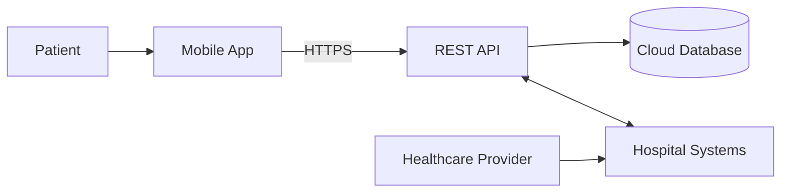
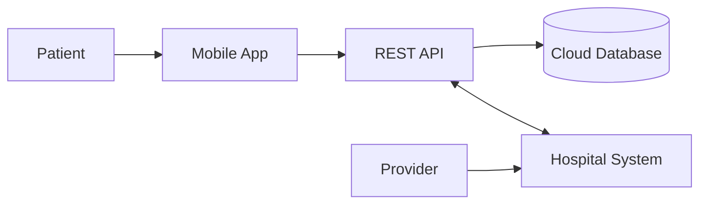
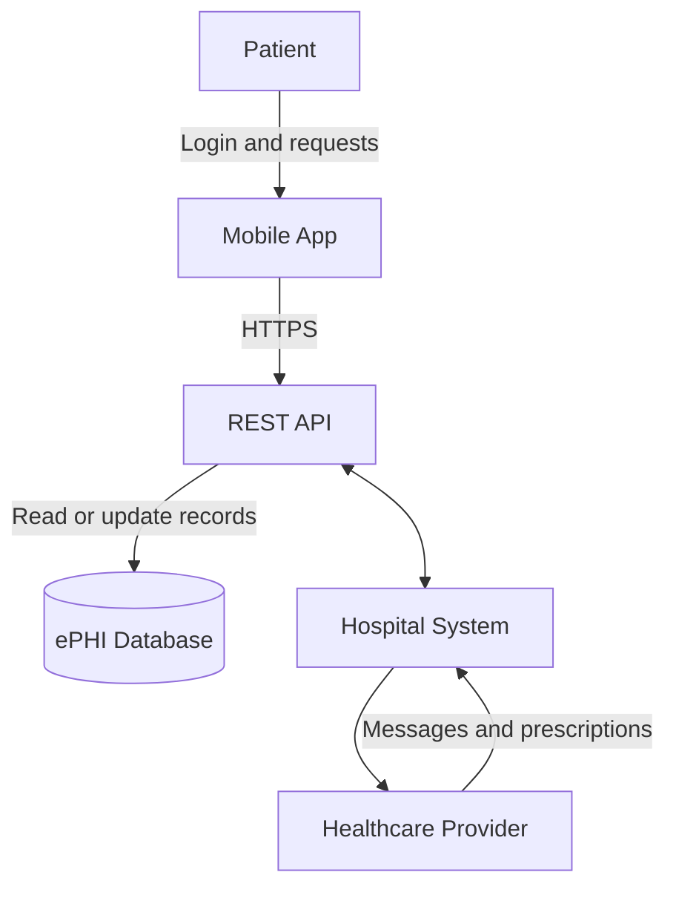
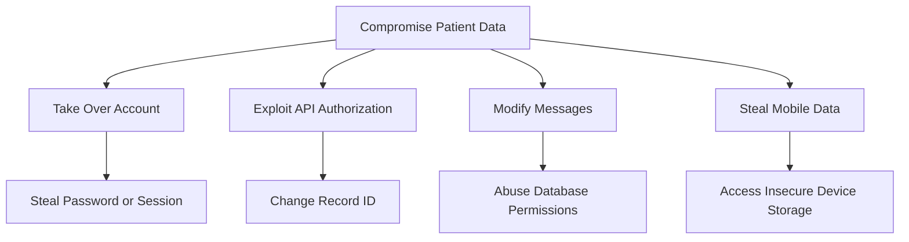

# Threat Model

> **System/Asset:** Healthcare Mobile App  
> **Date:** June 22, 2026  
> **Modeler:** [Mahdi Hamidi]  
> **Version:** 1.0

---

## System Overview

### System Description

The healthcare mobile app allows patients to:

- View medical records
- Schedule appointments
- Message healthcare providers
- Request prescription refills

The system uses:

- iOS and Android mobile clients
- REST API backend
- Cloud-hosted database
- Hospital-system integration

### System Architecture



### System Boundaries

**Included:**

- Mobile application
- REST API
- Authentication and authorization
- Cloud database
- Patient-provider messaging
- Hospital-system integration

**Excluded:**

- Internal hospital infrastructure
- Mobile operating-system security
- Cloud-provider physical infrastructure
- Healthcare provider-owned devices

---

## Asset Identification

### Critical Assets

|Asset ID|Asset Name|Description|Criticality|Value|
|---|---|---|---|---|
|A001|Patient ePHI|Medical records, diagnoses, prescriptions, and messages|Critical|Privacy and safety|
|A002|Provider Messages|Medical instructions exchanged with patients|Critical|Clinical|
|A003|Prescription Data|Medication and refill information|Critical|Patient safety|
|A004|Authentication Data|Passwords, MFA data, sessions, and tokens|Critical|Security|
|A005|Audit Logs|Records of access and important actions|High|Compliance|
|A006|Appointment Data|Patient and provider scheduling information|Medium|Operational|

### Most Critical Asset

**Patient electronic protected health information, or ePHI, is the most critical asset.**

|   |   |
|---|---|
|CIA Component|Importance|
|**Confidentiality**|Prevents unauthorized disclosure of medical information|
|**Integrity**|Ensures records, prescriptions, and messages remain accurate|
|**Availability**|Ensures patients and providers can access information when needed|

Loss of confidentiality creates a privacy breach. Loss of integrity or availability may affect treatment and patient safety.

---

## Threat Analysis Using STRIDE

### STRIDE Overview

STRIDE identifies six threat categories:

- Spoofing
- Tampering
- Repudiation
- Information Disclosure
- Denial of Service
- Elevation of Privilege

### Threat Identification

|   |   |   |   |   |   |   |
|---|---|---|---|---|---|---|
|STRIDE Category|Threat Description|Threat Scenario|Affected Assets|Likelihood|Impact|Risk Level|
|**Spoofing**|Attacker impersonates a provider|Stolen provider credentials are used to message patients|A001, A002, A004|Medium–High|Critical|Critical|
|**Tampering**|Medical message is modified|Medication instructions are changed|A002, A003|Medium|Critical|Critical|
|**Repudiation**|Sender denies sending a message|Incomplete logs cannot prove who sent instructions|A002, A005|Medium|High|High|
|**Information Disclosure**|Patient accesses another patient's messages|Message ID is changed in an API request|A001, A002|High|Critical|Critical|
|**Denial of Service**|Messaging or records become unavailable|API flooding prevents access to healthcare information|A001, A002|Medium|High|High|
|**Elevation of Privilege**|Patient gains provider permissions|Weak role checks allow access to provider functions|A001, A003, A004|Low–Medium|Critical|High|

---

## Detailed Threat Scenarios

### Threat 1: Provider Impersonation

**STRIDE Category:** Spoofing

**Threat Description:**

An attacker uses a compromised provider account to send false medical instructions.

**Threat Scenario:**

1. The attacker steals a doctor's password through phishing.
2. The attacker logs into the provider account.
3. A false prescription or treatment message is sent.
4. The patient believes the message is legitimate.

**Affected Assets:**

- Asset A001: Patient ePHI
- Asset A002: Provider messages
- Asset A003: Prescription data
- Asset A004: Authentication data

**Attack Vector:**

- Phishing
- Credential stuffing
- Stolen session token
- Weak authentication

**Likelihood:**

- **Qualitative:** Medium–High
- **Reasoning:** Provider accounts are valuable targets and may contain access to many patients.

**Impact:**

- **Confidentiality:** High
- **Integrity:** Critical
- **Availability:** Low
- **Overall:** Critical
- **Reasoning:** False medical instructions may directly harm a patient.

**Risk Level:** Critical

**Existing Controls:**

- Password authentication
- HTTPS

**Mitigation Recommendations:**

- Require MFA for provider accounts.
- Use short-lived secure sessions.
- Detect unusual login activity.
- Require reauthentication for prescription-related actions.
- Clearly display verified provider identity.

---

### Threat 2: Message Tampering

**STRIDE Category:** Tampering

**Threat Description:**

An attacker modifies a healthcare message while it is stored or transmitted.

**Threat Scenario:**

1. A provider sends “Take one tablet daily.”
2. An attacker exploits the API or database.
3. The message is changed to “Take three tablets daily.”
4. The patient follows the altered instruction.

**Affected Assets:**

- Asset A002: Provider messages
- Asset A003: Prescription data

**Attack Vector:**

- Insecure API
- Excessive database permissions
- Compromised provider account
- Insecure network communication

**Likelihood:**

- **Qualitative:** Medium
- **Reasoning:** Exploitation requires access to the message API, database, or account.

**Impact:**

- **Confidentiality:** Low
- **Integrity:** Critical
- **Availability:** Low
- **Overall:** Critical
- **Reasoning:** Modified clinical information could cause patient injury.

**Risk Level:** Critical

**Existing Controls:**

- HTTPS
- User authentication

**Mitigation Recommendations:**

- Use TLS for all communication.
- Enforce server-side authorization.
- Restrict database modification permissions.
- Store message version history.
- Log all message changes.

---

### Threat 3: Message Repudiation

**STRIDE Category:** Repudiation

**Threat Description:**

A patient or provider denies sending or receiving an important message.

**Threat Scenario:**

1. A provider sends prescription instructions.
2. A dispute occurs later.
3. The system has incomplete or editable logs.
4. The organization cannot confirm who sent or accessed the message.

**Affected Assets:**

- Asset A002: Provider messages
- Asset A005: Audit logs

**Attack Vector:**

- Missing audit logs
- Shared accounts
- Editable logs
- Unsynchronized timestamps

**Likelihood:**

- **Qualitative:** Medium
- **Reasoning:** The threat is realistic when audit logging is incomplete.

**Impact:**

- **Confidentiality:** Low
- **Integrity:** Medium
- **Availability:** Low
- **Overall:** High
- **Reasoning:** The organization may be unable to investigate disputes or incidents.

**Risk Level:** High

**Existing Controls:**

- Basic application logs

**Mitigation Recommendations:**

- Record sender, recipient, timestamp, and message ID.
- Protect logs from alteration.
- Use synchronized system clocks.
- Use unique accounts.
- Log delivery and access status.

---

### Threat 4: Unauthorized Message Access

**STRIDE Category:** Information Disclosure

**Threat Description:**

A patient accesses another patient's messages because the API does not verify record ownership.

**Threat Scenario:**

1. A patient requests `/api/messages/1050`.
2. The patient changes the ID to `/api/messages/1051`.
3. The backend verifies login but not message ownership.
4. Another patient's conversation is returned.

**Affected Assets:**

- Asset A001: Patient ePHI
- Asset A002: Provider messages

**Attack Vector:**

- Broken object-level authorization
- Predictable object IDs
- Missing server-side access checks

**Likelihood:**

- **Qualitative:** High
- **Reasoning:** Record IDs are easy to modify when authorization is not checked for every object.

**Impact:**

- **Confidentiality:** Critical
- **Integrity:** Low
- **Availability:** Low
- **Overall:** Critical
- **Reasoning:** Sensitive medical information may be exposed.

**Risk Level:** Critical

**Existing Controls:**

- User login
- API authentication

**Mitigation Recommendations:**

- Check ownership on every message request.
- Use server-side role and access checks.
- Never trust patient IDs from the mobile client.
- Test horizontal and vertical privilege escalation.
- Log failed authorization attempts.

---

## Vulnerability Analysis

### Identified Vulnerabilities

|   |   |   |   |   |   |
|---|---|---|---|---|---|
|Vuln ID|Vulnerability|Type|Exploitability|Severity|Related Threats|
|V001|Missing MFA for providers|Authentication|High|Critical|Provider impersonation|
|V002|Broken object-level authorization|Authorization|High|Critical|Message disclosure|
|V003|Excessive database permissions|Access control|Medium|High|Message tampering|
|V004|Weak session handling|Session management|High|High|Account takeover|
|V005|Incomplete audit logging|Logging|Medium|High|Repudiation|
|V006|Sensitive data stored insecurely|Data protection|Medium|Critical|ePHI exposure|

---

## Attack Surface Analysis

### Entry Points

|   |   |   |   |   |
|---|---|---|---|---|
|Entry Point|Description|Authentication Required|Access Level|Threats|
|EP001|Login endpoint|No|Public|Credential stuffing|
|EP002|Medical-record API|Yes|Patient/provider|Data disclosure|
|EP003|Messaging API|Yes|Patient/provider|Spoofing and tampering|
|EP004|Prescription API|Yes|Restricted|Unauthorized refill|
|EP005|Appointment API|Yes|Patient/provider|Unauthorized changes|
|EP006|Hospital integration|Service authentication|Internal/external|Data tampering|
|EP007|Mobile device storage|Device access|Local|Token and data theft|

### Data Flows

1. The patient authenticates through the mobile app.
2. The mobile app sends HTTPS requests to the REST API.
3. The API reads and writes patient information in the cloud database.
4. The API exchanges records and messages with hospital systems.
5. Providers access patient information through hospital systems.
6. Audit logs record important access and actions.

---

## Risk Assessment

### Risk Summary

|   |   |   |   |   |   |   |
|---|---|---|---|---|---|---|
|Risk ID|Threat|Vulnerability|Likelihood|Impact|Risk Level|Priority|
|R001|Provider impersonation|V001, V004|Medium–High|Critical|Critical|1|
|R002|Message tampering|V003|Medium|Critical|Critical|1|
|R003|Message repudiation|V005|Medium|High|High|2|
|R004|Unauthorized message access|V002|High|Critical|Critical|1|
|R005|Local patient-data exposure|V006|Medium|Critical|High|2|

### Risk Matrix

|   |   |   |   |
|---|---|---|---|
|Impact \ Likelihood|Low|Medium|High|
|**Critical**|High|Critical|Critical|
|**High**|Medium|High|High|
|**Medium**|Low|Medium|High|

---

## Mitigation Strategies

### Recommended Controls

|   |   |   |   |   |   |   |
|---|---|---|---|---|---|---|
|Control ID|Control Name|Control Type|Mitigates|Implementation Priority|Cost|Effectiveness|
|C001|MFA and secure authentication|Preventive|Account impersonation|Immediate|Medium|High|
|C002|Server-side authorization|Preventive|Unauthorized data access|Immediate|Medium|Critical|
|C003|Encryption in transit and at rest|Preventive|ePHI exposure|Immediate|Medium|High|
|C004|Audit logging and monitoring|Detective|Repudiation and misuse|Immediate|Medium|High|
|C005|Secure session management|Preventive|Session theft|Immediate|Low–Medium|High|
|C006|Secure mobile storage|Preventive|Local data exposure|Short-term|Medium|High|
|C007|API security testing|Detective|API vulnerabilities|Short-term|Medium|High|
|C008|Incident response process|Corrective|Security incidents|Short-term|Medium|High|

### Defense-in-Depth Layers

|   |   |   |
|---|---|---|
|Layer|Controls|Effectiveness|
|Physical|Secure cloud facilities, protected provider devices|Medium|
|Network|TLS, segmentation, API gateway|High|
|Host|Server hardening, patching, endpoint monitoring|High|
|Application|MFA, authorization, validation, secure sessions|Critical|
|Data|Encryption, backups, least privilege|Critical|
|Policies/Procedures|Access reviews, incident response, staff training|High|

---

## DREAD Analysis

### DREAD Scoring

|   |   |   |   |   |   |   |   |
|---|---|---|---|---|---|---|---|
|Threat|Damage|Reproducibility|Exploitability|Affected Users|Discoverability|Total Score|Risk Level|
|Provider impersonation|10|8|7|8|7|40|Critical|
|Message tampering|10|7|6|7|6|36|High|
|Message repudiation|7|8|5|5|6|31|High|
|Unauthorized message access|9|9|8|9|9|44|Critical|

**Average scores:**

```
Provider impersonation: 40 / 5 = 8.0
Message tampering: 36 / 5 = 7.2
Message repudiation: 31 / 5 = 6.2
Unauthorized message access: 44 / 5 = 8.8
```

---

## Diagrams

### System Architecture Diagram



### Data Flow Diagram



### Attack Tree



---

## Recommendations

### Immediate Actions

- Require MFA for provider accounts.
- Enforce authorization on every API object.
- Encrypt ePHI in transit and at rest.
- Use secure sessions and mobile token storage.
- Implement protected audit logging.

### Short-Term Actions

- Test messaging and record APIs.
- Review database and cloud permissions.
- Add anomaly detection.
- Improve incident-response procedures.
- Perform access reviews.

### Long-Term Actions

- Conduct regular penetration tests.
- Review hospital-system integrations.
- Maintain mobile and API security standards.
- Train healthcare staff against phishing.
- Continuously monitor ePHI access.

---

## Review and Update

**Next Review Date:** December 22, 2026

**Review Triggers:**

- New mobile or API features
- Hospital-integration changes
- Security incidents
- Regulatory changes
- Cloud architecture changes
- New threats or vulnerabilities

---

## References

- HHS, **HIPAA Security Rule**
- NIST, **SP 800-66 Rev. 2**
- OWASP, **API Security Top 10**
- OWASP, **Mobile Application Security Verification Standard**
- OWASP, **Authentication Cheat Sheet**
- OWASP, **Logging Cheat Sheet**

---

_This threat model should be reviewed and updated when the system changes or new threats are identified._