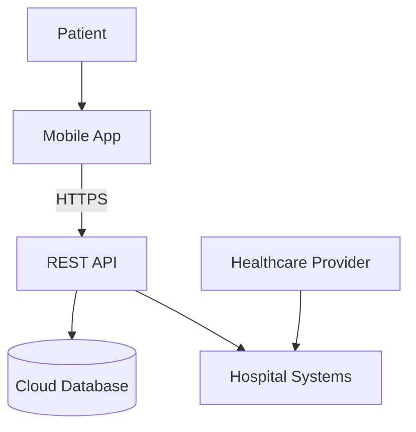

# 1. System Overview

The healthcare mobile application allows patients to:

- View medical records
- Schedule appointments
- Message healthcare providers
- Request prescription refills

The system includes:

- iOS and Android mobile clients
- REST API backend
- Cloud-hosted database
- Integration with hospital systems

---

# 2. Most Critical Asset

## Electronic Protected Health Information

The most critical asset is the patient's **electronic protected health information**, or **ePHI**.

This includes:

- Medical records
- Diagnoses
- Test results
- Prescriptions
- Provider messages
- Appointment information
- Patient identity information

Where HIPAA applies, regulated organizations must protect the confidentiality, integrity, and availability of ePHI.[1]

## CIA Triad Analysis

|CIA Component|Importance in the Healthcare App|
|---|---|
|**Confidentiality**|Medical information must only be accessible to the patient and authorized healthcare workers. Unauthorized disclosure could cause privacy violations, discrimination, identity theft, and regulatory consequences.|
|**Integrity**|Medical information must remain correct and complete. Altered prescriptions, test results, or provider messages could lead to incorrect treatment and patient harm.|
|**Availability**|Doctors and patients must be able to access important information when needed. An unavailable medical record or prescription system could delay treatment.|

## Conclusion

Patient ePHI is the most critical asset because failure in any part of the CIA Triad can create serious consequences:

- Loss of confidentiality causes a privacy breach.
- Loss of integrity may cause incorrect medical decisions.
- Loss of availability may delay patient care.

Integrity and availability are especially important in healthcare because incorrect or inaccessible information can affect patient safety.

---

# 3. STRIDE Analysis: Message Healthcare Providers

The messaging feature allows sensitive medical information to move between patients and healthcare professionals.

## Threat A: Attacker Impersonates a Doctor

|Attribute|Details|
|---|---|
|**STRIDE Category**|**Spoofing**|
|**Threat Description**|An attacker gains access to a provider account or creates requests that appear to come from a legitimate doctor.|
|**Attack Scenario**|1. An attacker steals a doctor's password through phishing.2. The attacker logs in to the provider account.3. They send a message telling a patient to change medication or disclose additional medical information.4. The patient believes the message came from the real doctor.|
|**Impact**|Incorrect treatment, medication misuse, disclosure of sensitive information, loss of trust, and possible patient harm.|
|**Likelihood**|**Medium to High**, especially if provider accounts use only passwords.|
|**Mitigation**|Require multifactor authentication for provider accounts, use strong session controls, detect unusual logins, and clearly display the verified identity and professional role of the message sender.|

---

## Threat B: Unauthorized Message Modification

|Attribute|Details|
|---|---|
|**STRIDE Category**|**Tampering**|
|**Threat Description**|An attacker changes the content of a message while it is transmitted or stored.|
|**Attack Scenario**|1. A doctor sends the message, “Take one tablet daily.”2. An attacker exploits an insecure API or database account.3. The message is changed to, “Take three tablets daily.”4. The patient follows the modified instruction.|
|**Impact**|Incorrect medication use, patient injury, inaccurate medical records, and legal consequences.|
|**Likelihood**|**Medium**, depending on API security, database permissions, and encryption.|
|**Mitigation**|Use TLS for communication, restrict database modification permissions, validate message ownership, maintain message version history, and use integrity checks or digital signatures for highly sensitive clinical instructions.|

---

## Threat C: Sender Denies Sending a Message

|Attribute|Details|
|---|---|
|**STRIDE Category**|**Repudiation**|
|**Threat Description**|A patient or healthcare provider denies sending or receiving an important medical message, and the system cannot prove what occurred.|
|**Attack Scenario**|1. A provider sends instructions about a prescription refill.2. The patient later reports that the instructions were never sent.3. The system has incomplete logs and cannot confirm who sent the message or when it was delivered.|
|**Impact**|Medical disputes, weak legal evidence, delayed treatment, investigation difficulties, and reduced accountability.|
|**Likelihood**|**Medium** if message activity is not logged securely.|
|**Mitigation**|Record the sender, recipient, timestamp, message ID, delivery status, and access events. Protect audit logs from alteration and synchronize system clocks. Sensitive message content should not be unnecessarily copied into general-purpose logs.|

---

## Threat D: Medical Messages Exposed to Another User

|Attribute|Details|
|---|---|
|**STRIDE Category**|**Information Disclosure**|
|**Threat Description**|A user accesses another patient's messages because the API does not correctly verify ownership.|
|**Attack Scenario**|1. A patient requests `/api/messages/1050`.2. They change the message ID to `/api/messages/1051`.3. The backend checks that the user is logged in but does not verify that message 1051 belongs to them.4. The API returns another patient's medical conversation.|
|**Impact**|Exposure of diagnoses, medications, personal information, and provider discussions; privacy violations; regulatory consequences.|
|**Likelihood**|**High** if object-level authorization is missing. APIs commonly expose record identifiers that attackers can modify.[2]|
|**Mitigation**|Perform object-level authorization on every message request. The backend must confirm that the authenticated user is the patient, assigned provider, or another explicitly authorized party before returning or modifying a message.|

---

## STRIDE Threat Summary

|Threat|STRIDE Category|Likelihood|Main Impact|Priority|
|---|---|--:|---|---|
|Doctor impersonation|Spoofing|Medium–High|Patient harm and fraud|Critical|
|Message modification|Tampering|Medium|Incorrect treatment|Critical|
|Denial of sending a message|Repudiation|Medium|Weak accountability|High|
|Unauthorized message access|Information Disclosure|High|Medical data breach|Critical|

---

# 4. Priority Security Controls

## Priority 1: Strong Authentication

### Control

- Require multifactor authentication for healthcare providers.
- Offer MFA to patients.
- Use strong password hashing.
- Add login rate limiting.
- Detect credential-stuffing attacks.
- Use short-lived and securely managed sessions.

### Why it is first

If an attacker takes over a patient or provider account, many other controls can be bypassed. The attacker may read records, send messages, request refills, or change appointments.

Strong authentication reduces the chance that an unauthorized person can enter the system.

### Practical constraint

Requiring MFA for every patient immediately may create usability and support problems. Provider MFA should be mandatory first because provider accounts usually have access to many patients.

---

## Priority 2: Server-Side Authorization and Least Privilege

### Control

- Check authorization on every API request.
- Verify ownership of records, messages, appointments, and prescriptions.
- Use role-based access control.
- Give users and services only the permissions they require.
- Do not trust patient IDs or provider IDs supplied by the mobile client.

### Why it is second

Authentication confirms identity, but authorization determines what that identity is allowed to access.

A logged-in patient must not be able to access another patient's records by changing an ID. OWASP identifies broken object-level authorization as a major API risk.[2]

### Practical constraint

Authorization must be implemented centrally in the REST API. Relying on controls inside individual mobile screens creates inconsistent protection.

---

## Priority 3: Encryption in Transit and at Rest

### Control

- Use TLS for all mobile, API, cloud, and hospital-system connections.
- Encrypt sensitive database fields and backups.
- Use secure cloud key-management services.
- Store mobile secrets and tokens using iOS Keychain or Android Keystore.
- Do not store unnecessary medical information on the device.

### Why it is third

Encryption protects patient data if network traffic is intercepted, a backup is exposed, or a mobile device is lost.

OWASP's mobile-security standard includes secure storage, cryptography, authentication, and network communication as key mobile security areas.[3]

### Practical constraint

Encryption is only effective when encryption keys are protected. Keys should not be hard-coded into the application or stored beside the encrypted database.

---

## Priority 4: Secure Audit Logging and Monitoring

### Control

Log important events such as:

- Successful and failed logins
- Medical-record access
- Message creation and access
- Prescription-refill requests
- Permission changes
- Failed authorization checks
- Unusual download activity

Protect logs from alteration and monitor them for suspicious behaviour.

### Why it is fourth

Audit logs help the organization:

- Detect attacks
- Investigate breaches
- Prove who accessed patient data
- Resolve disputes
- Support compliance reviews

NIST notes that log management supports the identification and investigation of security incidents.[4]

### Practical constraint

Logs should not contain passwords, authentication tokens, full prescription details, or unnecessary medical data. Logging too much sensitive information can create an additional data-breach risk.

---

## Priority 5: Secure Mobile and API Development

### Control

- Validate all API input.
- Use parameterized database queries.
- Test object-level authorization.
- Prevent sensitive data from appearing in mobile logs or screenshots.
- Keep libraries and mobile dependencies updated.
- Perform static analysis and API security testing.
- Test hospital-system integrations.
- Use secure coding requirements based on OWASP MASVS and ASVS.

### Why it is fifth

The application contains several connected attack surfaces:

- Mobile client
- REST API
- Cloud database
- Hospital integration
- Third-party libraries

A weakness in any one of these components may expose patient information.

### Practical constraint

A small team should first test the highest-risk features:

1. Login and session management
2. Medical-record access
3. Messaging
4. Prescription refills
5. Hospital integration

More advanced testing can be introduced over time.

---

# 5. Control Priority Summary

|Priority|Security Control|Main Risk Reduced|
|--:|---|---|
|1|Strong authentication|Stolen or compromised accounts|
|2|Authorization and least privilege|Unauthorized access to patient data|
|3|Encryption|Data interception and storage exposure|
|4|Audit logging and monitoring|Undetected misuse and weak accountability|
|5|Secure mobile and API development|Application and integration vulnerabilities|

---

# Conclusion

The most critical asset is the patient's electronic protected health information because it requires strong confidentiality, integrity, and availability.

The healthcare messaging feature faces several serious STRIDE threats:

- Attackers impersonating doctors
- Medical messages being modified
- Users denying that they sent messages
- Patients accessing another patient's conversations

The five highest-priority controls are:

1. Strong authentication
2. Server-side authorization and least privilege
3. Encryption in transit and at rest
4. Secure audit logging and monitoring
5. Secure mobile and API development

Authentication and authorization should be implemented first because they prevent unauthorized users from entering the system and restrict what authenticated users can access.

---

# References

[1] U.S. Department of Health and Human Services, **HIPAA Security Rule**.
[2] OWASP, **API1:2023 — Broken Object Level Authorization**.
[3] OWASP, **Mobile Application Security Verification Standard**.
[4] NIST, **Guide to Computer Security Log Management**.