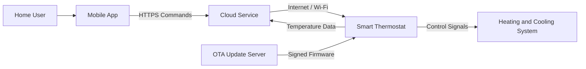
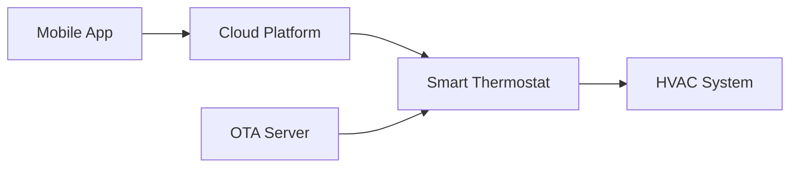
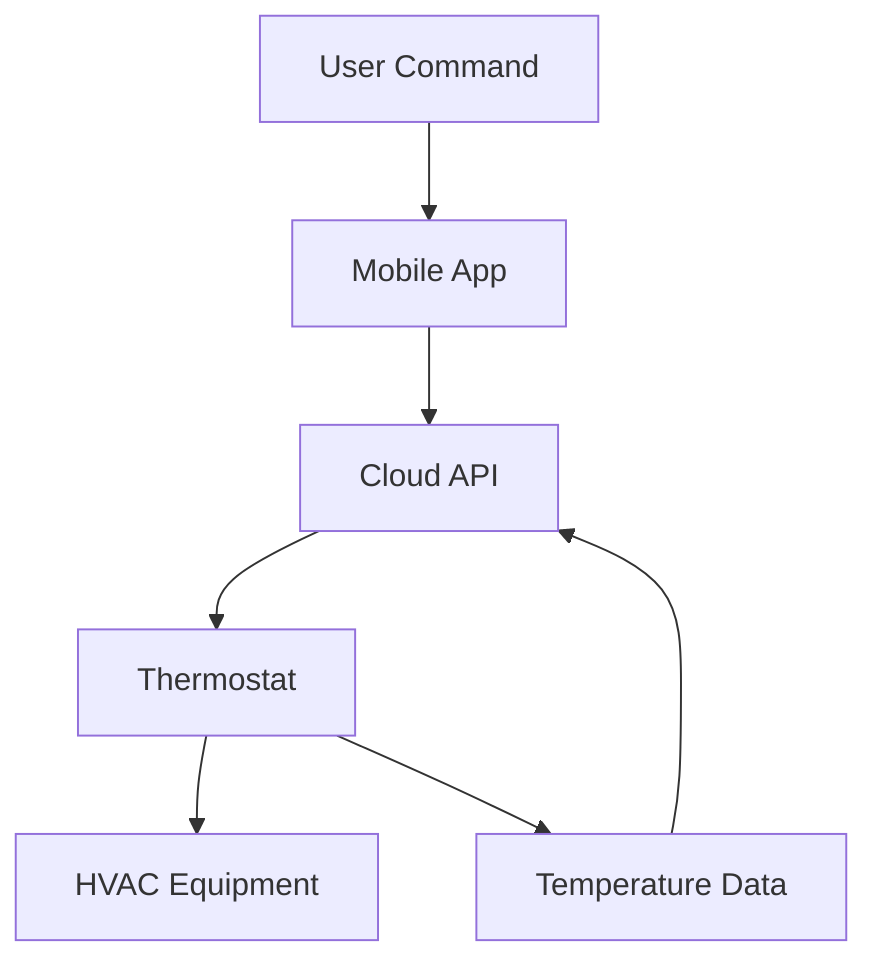
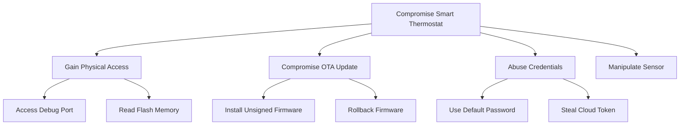

# Threat Model

> **System/Asset:** IoT Smart Thermostat  
> **Date:** June 22, 2026  
> **Modeler:** [Mahdi Hamidi]  
> **Version:** 1.0

---

## System Overview

### System Description

The smart thermostat:

- Connects to home Wi-Fi
- Controls heating and cooling systems
- Collects temperature and usage data
- Receives commands from a mobile application
- Downloads firmware through OTA updates

### System Architecture



### System Boundaries

**Included:**

- Smart thermostat hardware 
- Embedded firmware
- Mobile application communication
- Home Wi-Fi communication
- Cloud service
- OTA update process
- Heating and cooling control interface

**Excluded:**

- Internal operation of the home router
- Mobile operating-system security
- Internal cloud-provider infrastructure
- Mechanical security of the heating system

---

## Asset Identification

### Critical Assets

| Asset ID | Asset Name           | Description                                         | Criticality | Value       |
| -------- | -------------------- | --------------------------------------------------- | ----------- | ----------- |
| A001     | Device Firmware      | Software controlling the thermostat                 | Critical    | Operational |
| A002     | Device Credentials   | Wi-Fi, cloud, certificates, and device keys         | Critical    | Security    |
| A003     | HVAC Controls        | Commands sent to heating and cooling equipment      | Critical    | Safety      |
| A004     | Temperature Data     | Current and historical household temperature data   | High        | Privacy     |
| A005     | OTA Signing Keys     | Keys used to authorize firmware updates             | Critical    | Security    |
| A006     | Device Configuration | Temperature limits, schedules, and account settings | High        | Operational |

---

## Threat Analysis Using STRIDE

### STRIDE Overview

STRIDE identifies threats involving:

- Spoofing    
- Tampering
- Repudiation
- Information Disclosure
- Denial of Service
- Elevation of Privilege

### Threat Identification

| STRIDE Category            | Threat Description                                   | Threat Scenario                                  | Affected Assets  | Likelihood | Impact   | Risk Level |
| -------------------------- | ---------------------------------------------------- | ------------------------------------------------ | ---------------- | ---------- | -------- | ---------- |
| **Spoofing**               | Attacker impersonates the mobile app or cloud server | Fake commands are sent to the thermostat         | A003, A006       | Medium     | High     | High       |
| **Tampering**              | Malicious firmware is installed                      | Device accepts an unsigned OTA update            | A001, A003       | Medium     | Critical | Critical   |
| **Repudiation**            | Update or command cannot be traced                   | Logs do not show who changed the temperature     | A006             | Medium     | Medium   | Medium     |
| **Information Disclosure** | Firmware or credentials are extracted                | Attacker reads flash memory through a debug port | A001, A002       | High       | High     | High       |
| **Denial of Service**      | Device or update process is made unavailable         | Malformed traffic crashes the thermostat         | A001, A003       | Medium     | High     | High       |
| **Elevation of Privilege** | Debug interface gives root access                    | Attacker accesses UART or JTAG                   | A001, A002, A003 | High       | Critical | Critical   |

---

## Detailed Threat Scenarios

### Threat 1: Physical Device Compromise

**STRIDE Category:** Information Disclosure / Elevation of Privilege

**Threat Description:**

An attacker with physical access opens the thermostat and uses exposed hardware interfaces to extract firmware, credentials, or gain administrative access.

**Threat Scenario:**

1. The attacker removes the thermostat from the wall.    
2. The enclosure is opened.
3. The attacker identifies UART, JTAG, SWD, or flash-memory connections.
4. A debugger or memory reader is connected.
5. Firmware and stored data are extracted.
6. The attacker discovers credentials or security weaknesses.
7. Modified firmware is installed.
8. The thermostat or home network is compromised.

**Affected Assets:**

- Asset A001: Device firmware
- Asset A002: Device credentials
- Asset A003: HVAC controls
- Asset A006: Device configuration

**Attack Vector:**

- Physical access
- Exposed debug ports
- Unencrypted flash memory
- Weak enclosure protection

**Likelihood:**

- **Qualitative:** High
- **Reasoning:** Thermostats are physically accessible inside homes, and embedded debug interfaces may remain active.

**Impact:**

- **Confidentiality:** High
- **Integrity:** Critical
- **Availability:** High
- **Overall:** Critical
- **Reasoning:** The attacker may extract secrets, modify firmware, disable the device, or control heating and cooling.


**Risk Level:** Critical

**Existing Controls:**

- Device enclosure    
- Local account authentication


**Mitigation Recommendations:**

- Disable production JTAG, UART, and SWD interfaces.    
- Lock debug access using hardware security fuses.
- Encrypt sensitive local storage.
- Store device keys in a secure element.
- Use secure boot.
- Use device-unique credentials.
- Add tamper-evident enclosure features.

---

### Threat 2: Malicious OTA Firmware

**STRIDE Category:** Tampering

**Threat Description:**

The thermostat installs unauthorized or modified firmware because update authenticity is not verified.

**Threat Scenario:**

1. The thermostat requests a firmware update.    
2. An attacker intercepts or redirects the request.    
3. A malicious firmware image is supplied.    
4. The device fails to verify its digital signature.    
5. The malicious firmware is installed.
6. The attacker gains persistent control of the thermostat.

**Affected Assets:**

- Asset A001: Device firmware
- Asset A002: Device credentials
- Asset A003: HVAC controls
- Asset A005: OTA trust process

**Attack Vector:**

- Compromised update server
- Network interception
- DNS manipulation
- Missing signature verification

**Likelihood:**

- **Qualitative:** Medium
- **Reasoning:** Exploitation requires access to the update path, but insecure OTA designs remain highly dangerous.


**Impact:**

- **Confidentiality:** High    
- **Integrity:** Critical
- **Availability:** Critical
- **Overall:** Critical
- **Reasoning:** Malicious firmware can completely control or permanently disable the device.


**Risk Level:** Critical

**Existing Controls:**

- HTTPS update connection    
- Firmware version checking

**Mitigation Recommendations:**

- Digitally sign every firmware image.
- Verify signatures before installation.
- Use secure boot.
- Verify firmware hashes and image size.
- Use TLS with certificate validation.
- Protect signing keys in secure hardware.    
- Reject firmware for the wrong device model.

---

### Threat 3: Firmware Rollback Attack

**STRIDE Category:** Tampering

**Threat Description:**

An attacker installs an older, correctly signed firmware version that contains known vulnerabilities.

**Threat Scenario:**

1. The attacker obtains an old firmware package.    
2. The package has a valid manufacturer signature.
3. The thermostat accepts it because no minimum version is enforced.
4. A known vulnerability in the old firmware is exploited.
5. The attacker gains device control.

**Affected Assets:**

- Asset A001: Device firmware
- Asset A002: Device credentials
- Asset A003: HVAC controls

**Attack Vector:**

- Replayed firmware image
- Missing version counter
- Weak recovery process

**Likelihood:**

- **Qualitative:** Medium
- **Reasoning:** Old firmware may be publicly available and still have a valid signature.

**Impact:**

- **Confidentiality:** High
- **Integrity:** High
- **Availability:** High
- **Overall:** High

**Risk Level:** High

**Existing Controls:**

- Firmware version metadata

**Mitigation Recommendations:**

- Store a protected minimum firmware version.
- Include the version in the signed manifest.
- Reject older versions automatically.
- Allow rollback only through an authenticated recovery process.

---

## Vulnerability Analysis

### Identified Vulnerabilities

| Vuln ID | Vulnerability                           | Type            | Exploitability | Severity | Related Threats          |
| ------- | --------------------------------------- | --------------- | -------------- | -------- | ------------------------ |
| V001    | Exposed UART, JTAG, or SWD interfaces   | Hardware        | High           | Critical | Physical compromise      |
| V002    | Unencrypted local credential storage    | Data protection | High           | High     | Credential extraction    |
| V003    | Missing firmware-signature verification | Firmware        | Medium         | Critical | Malicious OTA update     |
| V004    | Missing rollback protection             | Firmware        | Medium         | High     | Firmware downgrade       |
| V005    | Shared default credentials              | Authentication  | High           | Critical | Unauthorized control     |
| V006    | Weak certificate validation             | Network         | Medium         | High     | Update interception      |
| V007    | No safe recovery partition              | Availability    | Medium         | High     | Permanent device failure |

---

## Attack Surface Analysis

### Entry Points

| Entry Point | Description        | Authentication Required | Access Level  | Threats               |
| ----------- | ------------------ | ----------------------- | ------------- | --------------------- |
| EP001       | Wi-Fi interface    | Yes                     | Network       | Spoofing, DoS         |
| EP002       | Cloud API          | Yes                     | Remote        | Unauthorized commands |
| EP003       | Mobile application | Yes                     | User          | Account compromise    |
| EP004       | OTA endpoint       | Device authentication   | System        | Malicious firmware    |
| EP005       | UART/JTAG/SWD      | Often none              | Physical/root | Firmware extraction   |
| EP006       | Flash-memory chip  | None                    | Physical      | Credential extraction |
| EP007       | Temperature sensor | None                    | Physical      | Sensor manipulation   |

### Data Flows

1. The mobile app sends commands to the cloud service.
    
2. The cloud service sends commands to the thermostat.
    
3. The thermostat sends temperature data to the cloud.
    
4. The thermostat sends control signals to the HVAC system.
    
5. The OTA server sends firmware and update metadata to the thermostat.
    

---

## Risk Assessment

### Risk Summary

| Risk ID | Threat                      | Vulnerability | Likelihood | Impact   | Risk Level | Priority |
| ------- | --------------------------- | ------------- | ---------- | -------- | ---------- | -------- |
| R001    | Physical device compromise  | V001, V002    | High       | Critical | Critical   | 1        |
| R002    | Malicious OTA firmware      | V003, V006    | Medium     | Critical | Critical   | 1        |
| R003    | Firmware rollback           | V004          | Medium     | High     | High       | 2        |
| R004    | Default credential abuse    | V005          | High       | Critical | Critical   | 1        |
| R005    | Failed update bricks device | V007          | Medium     | High     | High       | 2        |

### Risk Matrix

| Impact \ Likelihood | Low    | Medium   | High     |
| ------------------- | ------ | -------- | -------- |
| **Critical**        | High   | Critical | Critical |
| **High**            | Medium | High     | High     |
| **Medium**          | Low    | Medium   | High     |

---

## Mitigation Strategies

### Recommended Controls

| Control ID | Control Name               | Control Type | Mitigates                   | Implementation Priority | Cost       | Effectiveness |
| ---------- | -------------------------- | ------------ | --------------------------- | ----------------------- | ---------- | ------------- |
| C001       | Signed firmware            | Preventive   | Malicious updates           | Immediate               | Medium     | Critical      |
| C002       | Secure boot                | Preventive   | Unauthorized firmware       | Immediate               | Medium     | Critical      |
| C003       | Debug-port locking         | Preventive   | Physical compromise         | Immediate               | Low–Medium | High          |
| C004       | Rollback protection        | Preventive   | Firmware downgrade          | Immediate               | Low        | High          |
| C005       | Secure key storage         | Preventive   | Credential extraction       | Immediate               | Medium     | High          |
| C006       | A/B firmware partitions    | Corrective   | Failed updates              | Short-term              | Medium     | High          |
| C007       | TLS certificate validation | Preventive   | Network interception        | Immediate               | Low        | High          |
| C008       | Device-unique credentials  | Preventive   | Default-password attacks    | Immediate               | Medium     | High          |
| C009       | OTA monitoring             | Detective    | Update failures and attacks | Short-term              | Medium     | Medium        |

### Defense-in-Depth Layers

| Layer               | Controls                                           | Effectiveness |
| ------------------- | -------------------------------------------------- | ------------- |
| Physical            | Tamper evidence, locked debug ports                | High          |
| Network             | Wi-Fi security, TLS, segmentation                  | High          |
| Host                | Secure boot, hardened firmware                     | Critical      |
| Application         | Authentication, command validation                 | High          |
| Data                | Encryption, secure-element key storage             | High          |
| Policies/Procedures | Secure development, key management, update support | High          |

---

## DREAD Analysis

### DREAD Scoring

| Threat                     | Damage | Reproducibility | Exploitability | Affected Users | Discoverability | Total Score | Risk Level |
| -------------------------- | -----: | --------------: | -------------: | -------------: | --------------: | ----------: | ---------- |
| Physical device compromise |      9 |               8 |              7 |              6 |               8 |          38 | High       |
| Malicious OTA firmware     |     10 |               8 |              7 |             10 |               6 |          41 | Critical   |
| Firmware rollback          |      8 |               8 |              7 |              8 |               7 |          38 | High       |

**Average scores:**

```text
Physical compromise: 38 / 5 = 7.6
Malicious OTA firmware: 41 / 5 = 8.2
Firmware rollback: 38 / 5 = 7.6
```

---

## Diagrams

### System Architecture Diagram



### Data Flow Diagram



### Attack Tree



---

## Recommendations

### Immediate Actions

- Sign all firmware images.
    
- Verify signatures before installation.
    
- Implement secure boot.
    
- Disable or lock production debug ports.
    
- Use device-unique credentials.
    
- Enforce rollback protection.
    
- Validate OTA server certificates.
    

### Short-Term Actions

- Add A/B firmware partitions.
    
- Store keys in a secure element.
    
- Monitor update success and failure.
    
- Test physical interfaces and firmware extraction resistance.
    
- Add abnormal sensor-reading detection.
    

### Long-Term Actions

- Maintain security updates throughout the product lifetime.
    
- Rotate firmware-signing keys securely.
    
- Perform regular IoT penetration testing.
    
- Review third-party software components.
    
- Publish an end-of-support policy.
    

---

## Review and Update

**Next Review Date:** December 22, 2026

**Review Triggers:**

- Hardware revision    
- Firmware changes
- New OTA infrastructure
- Security incidents
- New device vulnerabilities
- Changes to cloud or mobile integrations
- End-of-support decisions

---

## References

- NIST, **IoT Device Cybersecurity Capability Core Baseline**    
- NIST, **Platform Firmware Resiliency Guidelines**
- NIST, **Foundational Cybersecurity Activities for IoT Device Manufacturers**
- OWASP, **Internet of Things Project**
- OWASP, **IoT Security Testing Guide**


---

_This threat model should be reviewed and updated when the system changes or new threats are identified._