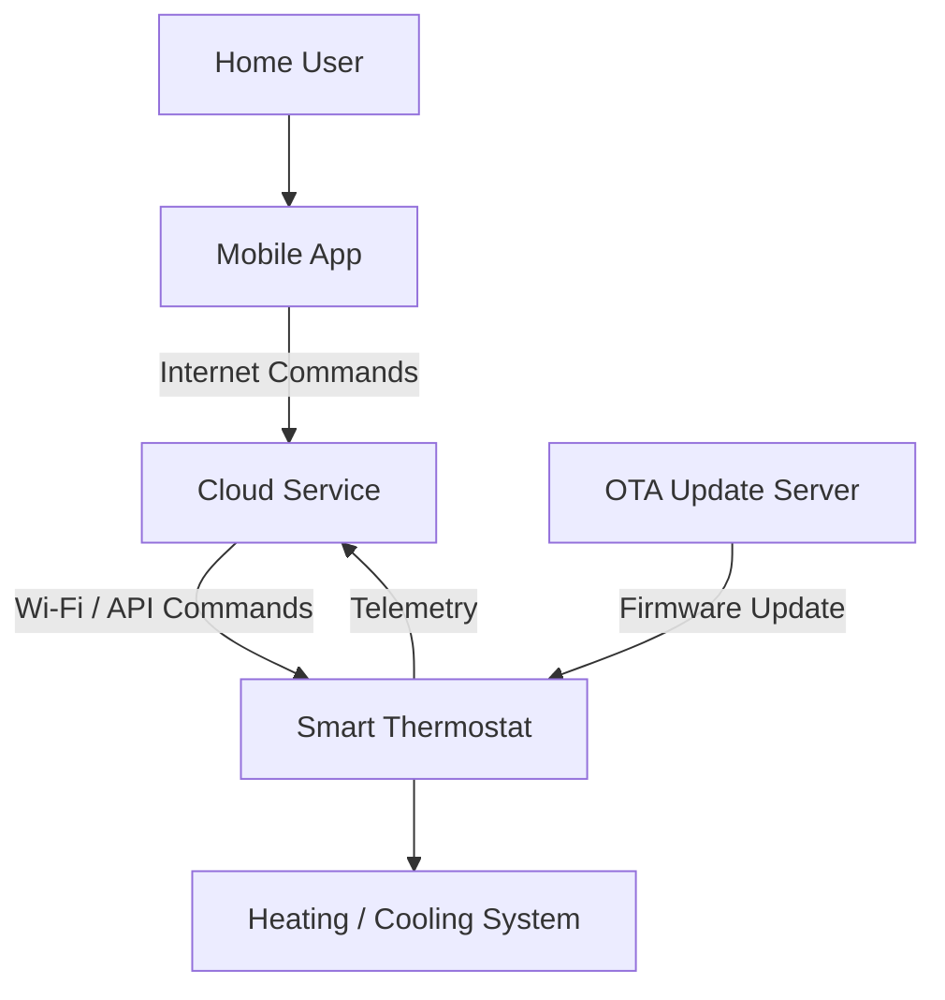
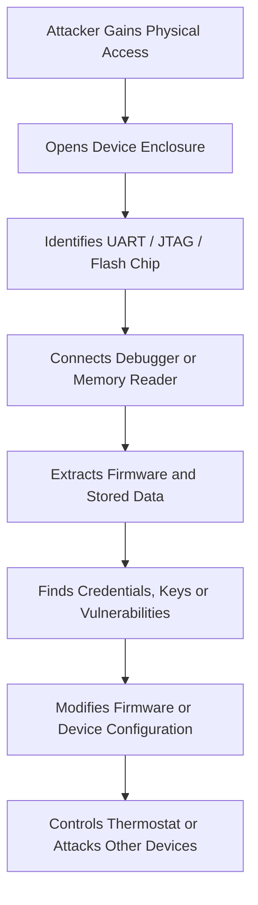
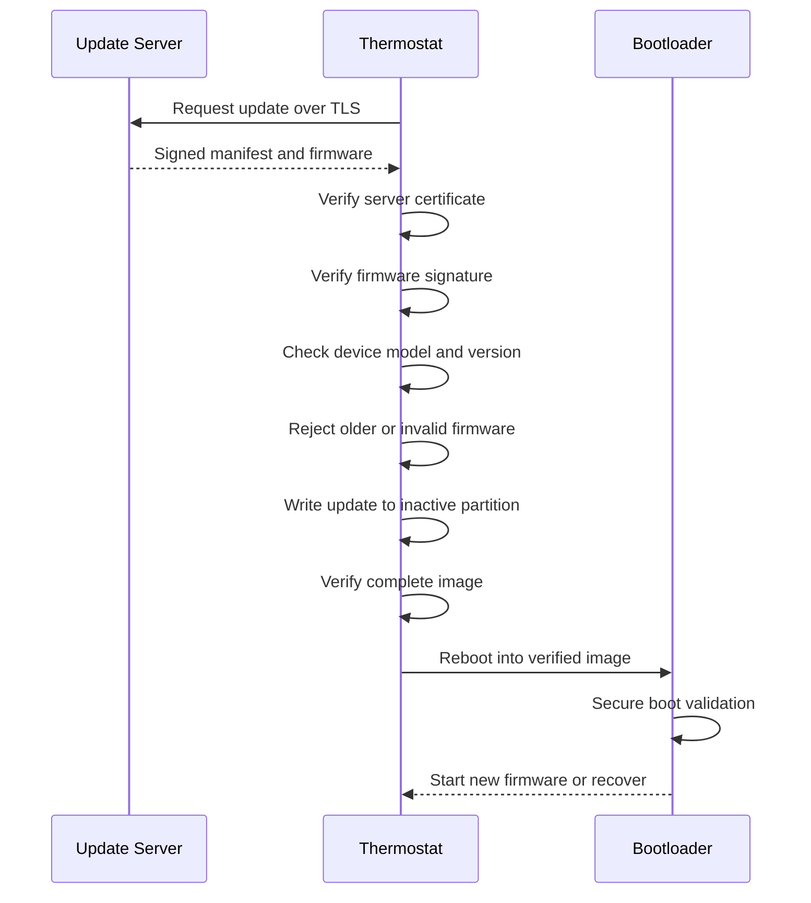

## 1. System Overview

The smart thermostat:

- Connects to home Wi-Fi
- Controls heating and cooling equipment
- Collects temperature and usage data
- Receives commands from a mobile application
- Downloads firmware updates over the internet




Unlike a normal web application, the thermostat is a physical device installed inside a home. It contains hardware, firmware, local interfaces, sensors, credentials, and direct control over heating and cooling equipment.

---

# 2. IoT-Specific Threats

## Threat 1: Physical Tampering

### Description

An attacker with physical access may open the thermostat, connect to internal components, or modify its hardware.

### Attack scenario

The attacker removes the thermostat from the wall and connects to exposed debug pins. They use the interface to read firmware or change device settings.

### Impact

- Firmware extraction
- Credential theft
- Bypass of authentication
- Permanent device compromise
- Unsafe heating or cooling commands


### Why it is IoT-specific

Web applications are normally hosted in controlled data centres. IoT devices are often installed in homes or public locations where attackers may physically reach them.

### Mitigation

- Disable production debug interfaces.
- Lock JTAG and UART access.
- Use tamper-resistant enclosures.
- Encrypt sensitive storage.
- Use secure boot.
- Remove unnecessary test points from production boards.

---

## Threat 2: Weak or Shared Default Credentials

### Description

The thermostat may be shipped with a predictable administrator password shared by every device.

### Attack scenario

The manufacturer ships all devices with:

```text
Username: admin
Password: admin
```

An attacker scans the network, logs in using the default password, and takes control of the thermostat.

### Impact

- Unauthorized temperature changes
- Access to household usage data
- Botnet enrollment
- Further attacks against the home network

### Why it is IoT-specific

Many embedded devices are designed for simple setup and may use factory credentials that users never change.

### Mitigation

- Give each device a unique initial credential.
- Require password creation during setup.
- Do not use universal default passwords.
- Rate-limit authentication attempts.
- Support secure credential reset.

---

## Threat 3: Exposed Debug and Maintenance Interfaces

### Description

Development interfaces such as JTAG, UART, SWD, USB, or serial consoles may remain active in the production device.

### Attack scenario

An attacker connects a USB-to-serial adapter to exposed UART pins. The interface provides a root shell without authentication.

### Impact

- Complete device control
- Firmware extraction
- Secret-key theft
- Security-control bypass
- Installation of malicious firmware

### Why it is IoT-specific

These hardware interfaces exist on embedded circuit boards and usually do not exist in standard web applications.

### Mitigation

- Disable or permanently lock debug ports before manufacturing.
- Require cryptographic authentication for maintenance access.
- Remove shell access from production firmware.
- Use hardware security fuses where supported.
- Test production devices for exposed interfaces.

---

## Threat 4: Firmware Extraction and Reverse Engineering

### Description

An attacker may copy firmware from flash memory or download an update package and analyze it.

### Attack scenario

The attacker removes the flash chip or accesses it through a debug interface. They extract the firmware and search it for:

- Hard-coded passwords
- Cloud API keys
- Encryption keys
- Hidden administrative commands
- Software vulnerabilities

### Impact

- Discovery of vulnerabilities affecting every device
- Exposure of shared credentials
- Creation of malicious firmware
- Large-scale remote attacks

### Why it is IoT-specific

IoT firmware may be stored directly on physically accessible memory chips and reused across thousands of identical devices.

### Mitigation

- Avoid hard-coded secrets.
- Use device-unique credentials.
- Encrypt sensitive data at rest.
- Store keys in secure hardware.
- Disable memory readout interfaces.
- Minimize unnecessary services and code.

---

## Threat 5: Sensor Manipulation

### Description

An attacker may physically or environmentally manipulate the temperature sensor without compromising software.

### Attack scenario

The attacker places a heat source, cold object, or airflow directly beside the sensor. The thermostat receives false temperature readings and activates heating or cooling unnecessarily.

### Impact

- Excessive energy use
- Unsafe room temperatures
- Equipment strain
- Incorrect automation decisions

### Why it is IoT-specific

The attack targets a physical sensor and its interaction with the real environment rather than a web form or API.

### Mitigation

- Detect unrealistic temperature changes.
- Compare data with secondary sensors where practical.
- Set safe operating limits.
- Alert users about abnormal readings.
- Allow manual shutdown or override.

---

## Threat 6: Malicious or Unsafe Firmware Installation

### Description

An attacker may replace a legitimate firmware update with modified or older vulnerable firmware.

### Attack scenario

The thermostat downloads an update without checking its digital signature. An attacker controlling the network sends a malicious firmware file that creates a hidden remote-access account.

### Impact

- Persistent device compromise
- Botnet participation
- Home-network access
- Loss of heating or cooling control
- Permanent device damage

### Why it is IoT-specific

Firmware controls the hardware and continues running after reboot. A malicious update can compromise the complete device below the application level.

### Mitigation

- Digitally sign all firmware.
- Verify signatures on the device.
- Use secure boot.
- Enforce rollback protection.
- Download updates through authenticated encrypted channels.
- Provide a secure recovery image.

---

## Threat 7: Device Theft and Reuse

### Description

A stolen or discarded device may still contain network credentials, cloud tokens, account information, or usage history.

### Attack scenario

A thermostat is removed from a house and sold without being reset. The new owner extracts stored Wi-Fi credentials or uses an active cloud token to access the previous owner's account.

### Impact

- Exposure of home-network credentials
- Privacy loss
- Unauthorized cloud access
- Tracking of household activity

### Mitigation

- Encrypt local data.
- Use device-bound credentials.
- Provide a secure factory-reset function.
- Revoke cloud tokens when ownership changes.
- Automatically erase secrets after repeated tampering attempts where appropriate.

---

## IoT Threat Summary

| Threat                | Main Impact                         | Priority |
| --------------------- | ----------------------------------- | -------- |
| Physical tampering    | Local or complete device compromise | High     |
| Default credentials   | Unauthorized remote control         | Critical |
| Exposed debug ports   | Root-level device access            | Critical |
| Firmware extraction   | Secrets and vulnerabilities exposed | High     |
| Sensor manipulation   | Unsafe or incorrect operation       | Medium   |
| Malicious firmware    | Persistent full-device compromise   | Critical |
| Device theft or reuse | Credential and privacy exposure     | High     |

---

# 3. Physical-Access Attack Chain

Physical access should be considered a serious threat because the attacker can directly reach the device hardware.

## Attack Chain



## Step 1: Access the Device

The attacker removes the thermostat from the wall or obtains a discarded or stolen unit.

## Step 2: Open the Enclosure

The attacker opens the casing and examines the circuit board for:

- UART pins
- JTAG or SWD connectors
- USB interfaces
- Flash-memory chips
- Test pads
- Reset pins

## Step 3: Connect to a Debug Interface

If an interface remains enabled, the attacker may obtain:

- Boot logs
- A command shell
- Memory access
- Administrative commands
- Firmware write capability

## Step 4: Extract Firmware or Memory

The attacker copies the firmware and searches for:

- Wi-Fi passwords
- Cloud tokens
- Private keys
- API credentials
- Hidden functions
- Update URLs
- Vulnerable libraries

## Step 5: Modify the Device

The attacker may:

- Disable authentication
- Change temperature limits
- Install a backdoor
- Replace trusted certificates
- Disable future updates
- Modify sensor readings
- Install older vulnerable firmware

## Step 6: Expand the Attack

If credentials are shared across products, one physically compromised thermostat may help the attacker compromise many other devices remotely.

The thermostat may also be used as an entry point into the home network.

---

## Potential Impacts

### Device impact

- Complete thermostat takeover
- Device failure or permanent damage
- Disabled security updates
- Incorrect sensor readings

### Household impact

- Unsafe indoor temperature
- Heating or cooling disruption
- Increased energy costs
- Damage to pipes, equipment, pets, plants, or property

### Privacy impact

Temperature and occupancy patterns may reveal:

- When people are home
- Daily routines
- Sleeping schedules
- Vacation periods

### Network impact

The compromised thermostat may be used to:

- Scan the home network
- Attack other devices
- Steal network credentials
- Join a botnet
- Send malicious traffic

---

## Physical Security Controls

- Disable JTAG, UART, and SWD in production.
- Use secure hardware fuses to lock debug access.
- Encrypt sensitive flash storage.
- Store device keys in a secure element.
- Use secure boot.
- Sign all firmware.
- Use device-specific credentials.
- Add tamper-evident casing.
- Erase sensitive data during a factory reset.
- Never store universal secrets across all devices.

Physical protection cannot make low-cost consumer hardware impossible to open. The realistic goal is to increase attack difficulty and prevent one compromised device from exposing the entire product fleet.

---

# 4. Secure OTA Update Design

The OTA update process must ensure that the thermostat installs only authentic, authorized, complete, and newer firmware.

## Secure OTA Flow



---

## Essential Requirement 1: Firmware Authenticity

### Requirement

Every firmware image must be digitally signed by the manufacturer.

The thermostat must verify the signature before installation.

### Purpose

This proves that the firmware came from an authorized source and was not created by an attacker.

### Implementation

- Sign firmware using a protected private key.
- Store the verification public key in protected device storage.
- Use modern, supported cryptographic algorithms.
- Reject firmware with missing or invalid signatures.
- Protect signing keys using a hardware security module where possible.

---

## Essential Requirement 2: Firmware Integrity

### Requirement

The device must verify that the complete firmware image has not been changed or corrupted.

### Purpose

An incomplete or modified image may contain malware or make the thermostat unusable.

### Implementation

- Include a cryptographic hash in the signed update manifest.
    
- Verify the complete image after download.
    
- Verify the written image before reboot.
    
- Reject truncated, corrupted, or unexpected files.
    

A hash alone is not sufficient because an attacker could replace both the firmware and its hash. The hash must be protected by a digital signature.

---

## Essential Requirement 3: Secure Boot

### Requirement

The bootloader must verify the firmware each time the thermostat starts.

### Purpose

OTA verification protects the update process, while secure boot protects every later startup.

Without secure boot, an attacker with physical access might directly write malicious firmware into memory and bypass the OTA process.

### Implementation

- Establish a hardware-backed root of trust.
- Verify the bootloader and firmware signature.
- Stop or enter secure recovery if verification fails.
- Protect the bootloader from unauthorized modification.

---

## Essential Requirement 4: Encrypted and Authenticated Transport

### Requirement

Firmware and metadata must be downloaded using a secure protocol such as HTTPS with proper certificate validation.

### Purpose

Transport encryption reduces interception, traffic manipulation, and disclosure of update information.

### Implementation

- Use TLS.
- Validate server certificates correctly.
- Reject expired, untrusted, or mismatched certificates.
- Disable insecure protocols and obsolete cryptography.
- Consider certificate or public-key pinning where operationally suitable.

TLS is a defence layer, but the firmware signature remains essential. The device must still reject unsigned firmware even when it arrives through HTTPS.

---

## Essential Requirement 5: Rollback Protection

### Requirement

The thermostat must reject firmware older than the minimum approved version.

### Purpose

An attacker may attempt to install an old but correctly signed firmware version containing known vulnerabilities.

### Implementation

- Include the firmware version in the signed manifest.
- Store a protected minimum-version counter.
- Reject versions below the allowed security level.
- Allow emergency rollback only through a controlled and authenticated recovery process.

---

## Essential Requirement 6: Device and Model Compatibility

### Requirement

The thermostat must verify that the firmware is intended for its exact model and hardware revision.

### Purpose

Installing firmware for another device may cause failure, unsafe behaviour, or hardware damage.

### Implementation

The signed update manifest should include:

```text
- Product model
- Hardware revision
- Firmware version
- Minimum bootloader version
- Image size
- Cryptographic hash
- Release identifier
```

The device must compare these values with its own protected identity before installation.

---

## Essential Requirement 7: Safe Installation and Recovery

### Requirement

Power loss or network failure must not permanently damage the thermostat.

### Purpose

A thermostat may lose power during an update. It must continue operating safely or recover automatically.

### Implementation

- Use A/B firmware partitions.
- Write the update to an inactive partition.
- Verify the image before activation.
- Keep the previous known-good image.
- Automatically roll back if startup fails.
- Include a protected recovery mode.
- Preserve safe minimum heating or cooling behaviour during failure.

---

## Essential Requirement 8: Authorization and Access Control

### Requirement

Only authorized manufacturer systems and authorized device processes may initiate or approve updates.

### Purpose

An attacker should not be able to redirect the device to an unofficial update server or trigger uncontrolled installations.

### Implementation

- Authenticate update servers.
- Protect update configuration.
- Restrict who can publish firmware.
- Separate development, signing, and production-release permissions.
- Require approval for production releases.
- Log firmware publication and signing events.

---

## Essential Requirement 9: Update Logging and Monitoring

### Requirement

The system should record important OTA events.

### Events to record

- Update request
- Current and target version
- Signature-verification result
- Download failure
- Installation result
- Rollback event
- Recovery-mode activation

### Purpose

Logs help detect attack attempts, failed deployments, and vulnerable devices that have not updated.

Logs should not expose secret keys or sensitive household information.

---

## Essential Requirement 10: Long-Term Update Support

### Requirement

The manufacturer must define how long security updates will remain available.

### Purpose

A technically secure OTA mechanism has limited value if the vendor stops issuing patches while devices remain in use.

### Implementation

- Publish a support period.
- Notify users before support ends.
- Maintain an inventory of device versions.
- Provide updates for known critical vulnerabilities.
- Use phased deployment to reduce fleet-wide failure.
- Provide a secure end-of-life process.

---

# 5. OTA Security Requirements Summary

| Requirement                    | Main Purpose                               | Priority |
| ------------------------------ | ------------------------------------------ | -------- |
| Digital signatures             | Prove firmware authenticity                | Critical |
| Integrity verification         | Detect modified or corrupted images        | Critical |
| Secure boot                    | Prevent unauthorized firmware from running | Critical |
| TLS and certificate validation | Protect update transport                   | High     |
| Rollback protection            | Block old vulnerable versions              | Critical |
| Model and version validation   | Prevent incompatible installation          | High     |
| A/B update and recovery        | Prevent permanent device failure           | Critical |
| Update authorization           | Restrict update publication and control    | High     |
| Logging and monitoring         | Detect failures and attacks                | Medium   |
| Long-term vendor support       | Ensure vulnerabilities can be patched      | High     |

---

# 6. Priority Actions

| Priority | Action                                                |
| -------: | ----------------------------------------------------- |
|        1 | Sign all firmware and verify signatures on the device |
|        2 | Implement secure boot using a hardware root of trust  |
|        3 | Add rollback protection                               |
|        4 | Use A/B partitions and a protected recovery image     |
|        5 | Disable production debug interfaces                   |
|        6 | Use device-unique credentials and secure key storage  |
|        7 | Use TLS with correct certificate validation           |
|        8 | Add OTA event logging and fleet-version monitoring    |

---

# Conclusion

The smart thermostat faces threats that are uncommon or less significant in normal web applications because it includes physical hardware, firmware, sensors, local memory, and debug interfaces.

The most important IoT-specific risks are:

- Physical tampering
- Shared default credentials
- Exposed debug ports
- Firmware extraction
- Sensor manipulation
- Malicious firmware installation
- Theft of locally stored credentials

Physical access may allow an attacker to extract firmware, steal secrets, modify the operating system, control the heating system, and use the thermostat as an entry point into the home network.

A secure OTA process must provide:

1. Digitally signed firmware
2. Integrity verification
3. Secure boot
4. Encrypted and authenticated downloads
5. Rollback protection
6. Hardware compatibility checks
7. Safe recovery from failed updates
8. Strong update authorization
9. Security logging
10. Long-term update support

The most important principle is that the thermostat must never install or execute firmware unless its authenticity, integrity, version, and hardware compatibility have been verified.