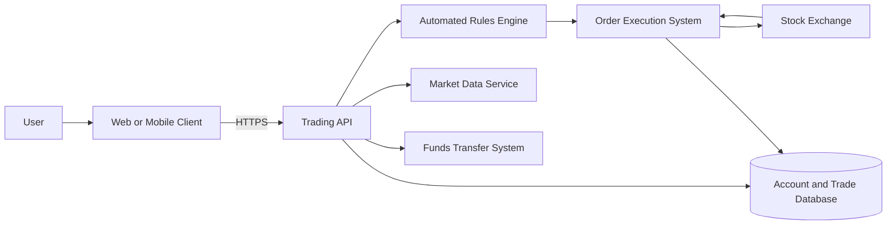
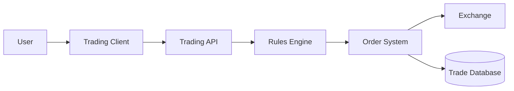
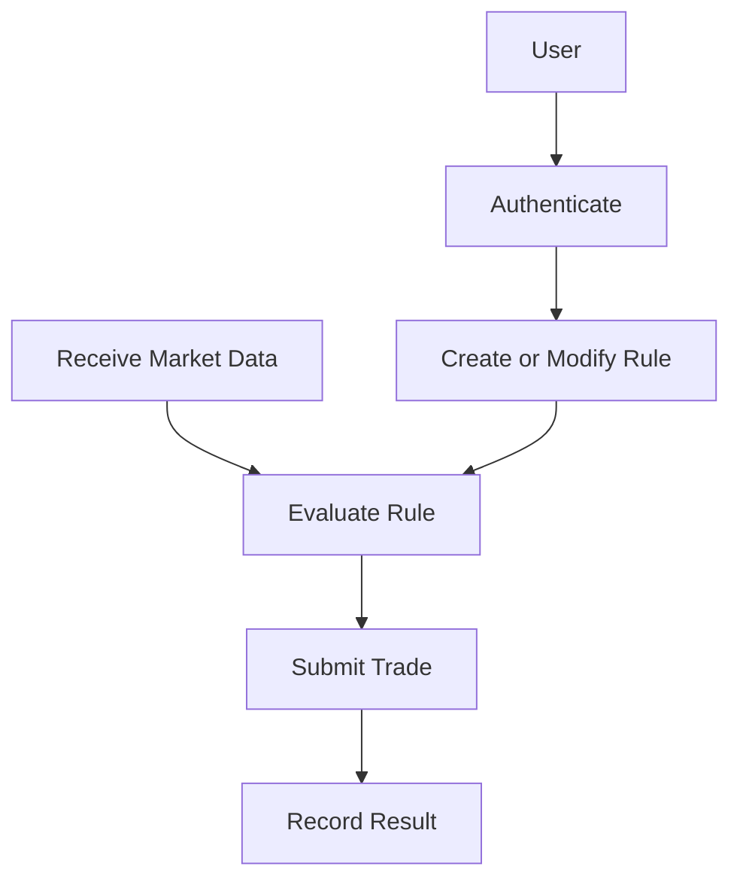
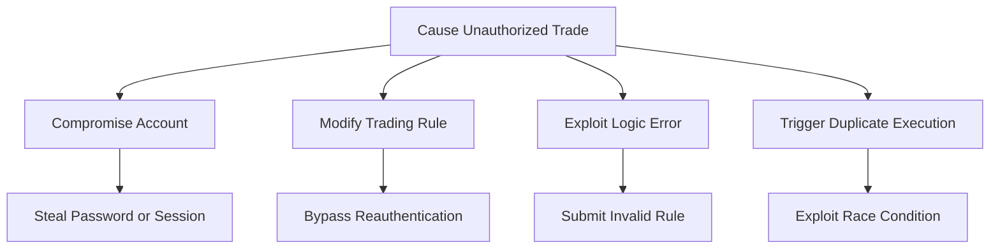

# Threat Model

> **System/Asset:** Financial Trading Platform  
> **Date:** June 22, 2026  
> **Modeler:** [Mahdi ]  
> **Version:** 1.0

---

## System Overview

### System Description

The platform allows users to:

- View real-time stock prices
- Execute buy and sell orders
- Transfer funds
- Create automated trading rules


The system requires:

- 99.99% availability
- Trade execution latency below 100 ms
- Compliance with SEC and FINRA requirements

### System Architecture



### System Boundaries

**Included:**

- User authentication
- Automated trading rules
- Trade execution
- Fund transfers
- Account and trade records
- Market-data processing


**Excluded:**

- Internal systems operated by stock exchanges
- Banking systems outside the platform
- User-owned devices beyond the client application

---

## Asset Identification

### Critical Assets

| Asset ID | Asset Name              | Description                                                     | Criticality | Value       |
| -------- | ----------------------- | --------------------------------------------------------------- | ----------- | ----------- |
| A001     | Trade Orders            | Buy and sell instructions submitted by users or automated rules | Critical    | Financial   |
| A002     | Account Balances        | Cash and securities owned by users                              | Critical    | Financial   |
| A003     | Automated Trading Rules | User-defined conditions that automatically create trades        | Critical    | Financial   |
| A004     | Authentication Data     | Passwords, MFA data, sessions, and tokens                       | Critical    | Security    |
| A005     | Audit Logs              | Records of logins, rule changes, trades, and transfers          | High        | Regulatory  |
| A006     | Market Data             | Real-time prices used for trading decisions                     | High        | Operational |

### Most Critical CIA Component

**Integrity** is the most critical component.

Incorrect or modified orders, balances, prices, or automated rules could cause immediate financial loss. Availability is also essential because the system must remain accessible during trading hours.

Security controls may increase latency. For example, authorization checks, fraud detection, encryption, and logging require processing time. These controls should be optimized rather than removed.

---

## Threat Analysis Using STRIDE

### STRIDE Overview

STRIDE identifies six threat categories:

- Spoofing
- Tampering
- Repudiation
- Information Disclosure    
- Denial of Service
- Elevation of Privilege

### Threat Identification

|STRIDE Category|Threat Description|Threat Scenario|Affected Assets|Likelihood|Impact|Risk Level|
|---|---|---|---|---|---|---|
|**Spoofing**|Attacker impersonates a user|Stolen credentials are used to access a trading account|A002, A003, A004|High|Critical|Critical|
|**Tampering**|Automated rule is modified|Attacker changes a rule to sell all shares|A001, A002, A003|High|Critical|Critical|
|**Repudiation**|User denies changing a rule|Logs cannot prove who modified an automated rule|A003, A005|Medium|High|High|
|**Information Disclosure**|Account or strategy data is exposed|Attacker accesses balances or private trading rules|A002, A003|Medium|High|High|
|**Denial of Service**|Rules engine becomes unavailable|Attack traffic prevents automated orders from executing|A001, A003|Medium|Critical|High|
|**Elevation of Privilege**|User gains administrative permissions|Broken authorization allows access to other accounts|A002, A003, A004|Low–Medium|Critical|High|

---

## Detailed Threat Scenarios

### Threat 1: Unauthorized Trading Rule Modification

**STRIDE Category:** Tampering

**Threat Description:**

An attacker modifies a user's automated trading rule after compromising the account or session.

**Threat Scenario:**

1. The attacker steals the user's session token.
2. The attacker accesses the automated-rules page.
3. A rule is changed from “sell 10 shares” to “sell all shares.”    
4. The modified rule executes during market movement.    
5. The user suffers financial loss.    

**Affected Assets:**

- Asset A001: Trade orders    
- Asset A002: Account balances    
- Asset A003: Automated trading rules


**Attack Vector:**

- Stolen session    
- Weak authorization  
- Missing reauthentication   
- Compromised user account

**Likelihood:**

- **Qualitative:** High
- **Reasoning:** Rule changes are possible after account compromise unless extra authorization is required.

**Impact:**

- **Confidentiality:** Low
- **Integrity:** Critical
- **Availability:** Low
- **Overall:** Critical
- **Reasoning:** The attacker can create unauthorized financial transactions.

**Risk Level:** Critical

**Existing Controls:**

- User login
- HTTPS communication

**Mitigation Recommendations:**

- Require MFA or reauthentication before rule changes.
- Send immediate notifications when rules are created or modified.
- Allow users to freeze automated trading.
- Apply transaction and position limits.
- Record immutable rule-change logs.

---

### Threat 2: Trading Rule Logic Failure

**STRIDE Category:** Tampering

**Threat Description:**

A logic or validation error causes an automated rule to create incorrect trades.

**Threat Scenario:**

1. The user creates a rule to buy 10 shares.
2. A decimal or quantity-handling error interprets the value as 10,000.
3. The platform submits an excessive order.
4. The user suffers a large unexpected loss.

**Affected Assets:**

- Asset A001: Trade orders
- Asset A002: Account balances
- Asset A003: Automated trading rules

**Attack Vector:**

- Invalid rule input
- Software defect
- Missing quantity limits
- Incorrect unit conversion

**Likelihood:**

- **Qualitative:** Medium
- **Reasoning:** Logic flaws are possible in complex rule engines, especially without testing and limits.

**Impact:**

- **Confidentiality:** Negligible
- **Integrity:** Critical
- **Availability:** Low
- **Overall:** Critical
- **Reasoning:** Incorrect trades may create immediate financial loss.

**Risk Level:** High

**Existing Controls:**

- Basic input validation
- Order-processing logic

**Mitigation Recommendations:**

- Validate all rule conditions and values.
- Apply maximum trade and position limits.
- Show a clear rule preview before activation.
- Test rules using simulation or paper trading.
- Require confirmation for unusually large orders.

---

### Threat 3: Duplicate Automated Trade Execution

**STRIDE Category:** Tampering

**Threat Description:**

A race condition causes the same automated rule to execute more than once.

**Threat Scenario:**

1. A stock reaches the user's target price.    
2. Two workers process the same event simultaneously.
3. Both workers submit the same order.
4. The user receives twice the expected position.

**Affected Assets:**

- Asset A001: Trade orders
- Asset A002: Account balances
- Asset A003: Automated trading rules

**Attack Vector:**

- Concurrent requests
- Distributed worker race condition
- Missing idempotency controls

**Likelihood:**

- **Qualitative:** Medium
- **Reasoning:** High market volume and distributed processing increase concurrency risk.

**Impact:**

- **Confidentiality:** Negligible
- **Integrity:** High
- **Availability:** Low
- **Overall:** High
- **Reasoning:** Duplicate orders may cause financial loss and reconciliation problems.

**Risk Level:** High

**Existing Controls:**

- Database transaction processing
- Order IDs

**Mitigation Recommendations:**

- Use unique execution identifiers.
- Make trade submission idempotent.
- Use atomic database transactions.
- Apply distributed locks where necessary.
- Record rule execution before order submission.


---

## Vulnerability Analysis

### Identified Vulnerabilities

| Vuln ID | Vulnerability                             | Type               | Exploitability | Severity | Related Threats                |
| ------- | ----------------------------------------- | ------------------ | -------------- | -------- | ------------------------------ |
| V001    | Missing reauthentication for rule changes | Authentication     | High           | Critical | Unauthorized rule modification |
| V002    | Weak server-side validation               | Application logic  | Medium         | High     | Rule logic failure             |
| V003    | Missing idempotency controls              | Concurrency        | Medium         | High     | Duplicate execution            |
| V004    | Weak session handling                     | Session management | High           | Critical | Account takeover               |
| V005    | Excessive account permissions             | Authorization      | Medium         | Critical | Elevation of privilege         |

---

## Attack Surface Analysis

### Entry Points

| Entry Point | Description              | Authentication Required | Access Level | Threats                |
| ----------- | ------------------------ | ----------------------- | ------------ | ---------------------- |
| EP001       | Login endpoint           | No                      | Public       | Credential stuffing    |
| EP002       | Automated-rules API      | Yes                     | User         | Rule modification      |
| EP003       | Trade-order API          | Yes                     | User         | Unauthorized trades    |
| EP004       | Fund-transfer API        | Yes                     | User         | Fraudulent transfers   |
| EP005       | Market-data feed         | Service authentication  | Internal     | Data manipulation      |
| EP006       | Administrative interface | Yes                     | Privileged   | Elevation of privilege |

### Data Flows

1. The user sends login and trading requests to the API.    
2. The API validates the user and account permissions.
3. Automated rules receive market-data events.
4. The rules engine sends trade instructions to the order system.
5. The order system sends orders to the exchange.
6. Trade results are stored in the database.
7. Transfers are sent to the funds system.

---

## Risk Assessment

### Risk Summary

| Risk ID | Threat                         | Vulnerability | Likelihood | Impact   | Risk Level | Priority |
| ------- | ------------------------------ | ------------- | ---------- | -------- | ---------- | -------- |
| R001    | Unauthorized rule modification | V001, V004    | High       | Critical | Critical   | 1        |
| R002    | Rule logic failure             | V002          | Medium     | Critical | High       | 2        |
| R003    | Duplicate execution            | V003          | Medium     | High     | High       | 3        |
| R004    | Account takeover               | V004          | High       | Critical | Critical   | 1        |
| R005    | Privilege escalation           | V005          | Low–Medium | Critical | High       | 2        |

### Risk Matrix

| Impact \ Likelihood | Low    | Medium | High     |
| ------------------- | ------ | ------ | -------- |
| **Critical**        | High   | High   | Critical |
| **High**            | Medium | High   | High     |
| **Medium**          | Low    | Medium | High     |

---

## Mitigation Strategies

### Recommended Controls

| Control ID | Control Name                    | Control Type | Mitigates                      | Implementation Priority | Cost       | Effectiveness |
| ---------- | ------------------------------- | ------------ | ------------------------------ | ----------------------- | ---------- | ------------- |
| C001       | MFA and reauthentication        | Preventive   | Account and rule compromise    | Immediate               | Medium     | High          |
| C002       | Transaction and position limits | Preventive   | Excessive financial loss       | Immediate               | Low        | High          |
| C003       | Anomaly detection               | Detective    | Suspicious trading behaviour   | Short-term              | Medium     | High          |
| C004       | Idempotent trade execution      | Preventive   | Duplicate trades               | Immediate               | Medium     | High          |
| C005       | Secure session management       | Preventive   | Session hijacking              | Immediate               | Low–Medium | High          |
| C006       | Immutable audit logs            | Detective    | Repudiation and investigations | Short-term              | Medium     | High          |
| C007       | User notifications              | Detective    | Delayed compromise detection   | Immediate               | Low        | Medium        |
| C008       | Rule simulation and validation  | Preventive   | Logic failures                 | Short-term              | Medium     | High          |

### Defense-in-Depth Layers

| Layer               | Controls                                             | Effectiveness |
| ------------------- | ---------------------------------------------------- | ------------- |
| Physical            | Secure data-centre access                            | Medium        |
| Network             | TLS, segmentation, DDoS protection                   | High          |
| Host                | Hardening, patching, endpoint monitoring             | High          |
| Application         | MFA, authorization, limits, idempotency              | Critical      |
| Data                | Encryption, database permissions, backups            | High          |
| Policies/Procedures | Incident response, change control, compliance review | High          |

---

## DREAD Analysis

### DREAD Scoring

| Threat                         | Damage | Reproducibility | Exploitability | Affected Users | Discoverability | Total Score | Risk Level |
| ------------------------------ | -----: | --------------: | -------------: | -------------: | --------------: | ----------: | ---------- |
| Unauthorized rule modification |     10 |               8 |              8 |              7 |               8 |          41 | Critical   |
| Rule logic failure             |      9 |               7 |              5 |              6 |               6 |          33 | High       |
| Duplicate execution            |      8 |               8 |              5 |              6 |               5 |          32 | High       |

**Average scores:**

```text
Unauthorized rule modification: 41 / 5 = 8.2
Rule logic failure: 33 / 5 = 6.6
Duplicate execution: 32 / 5 = 6.4
```

---

## Diagrams

### System Architecture Diagram



### Data Flow Diagram



### Attack Tree



---

## Recommendations

### Immediate Actions

- Require MFA and reauthentication for sensitive actions.    
- Apply transaction and position limits.
- Implement idempotency for rule execution.
- Strengthen session security.
- Notify users of rule changes and large trades.

### Short-Term Actions

- Add anomaly detection.    
- Introduce rule simulation and validation.
- Create immutable audit trails.
- Perform concurrency and authorization testing.

### Long-Term Actions

- Improve fraud-detection models.
- Conduct regular penetration testing
- Review regulatory and compliance requirements.
- Continuously monitor system latency and availability.

---

## Review and Update

**Next Review Date:** December 22, 2026

**Review Triggers:**

- Changes to automated trading logic    
- New market integrations
- Security incidents
- Regulatory changes
- Major infrastructure changes
- New threats or vulnerabilities

---

## References

- SEC, **Regulation Systems Compliance and Integrity**    
- FINRA, **Customer Account Takeover Guidance**
- NIST, **Digital Identity Guidelines**
- OWASP, **Transaction Authorization Cheat Sheet**
- OWASP, **Session Management Cheat Sheet**
- OWASP, **Logging Cheat Sheet**

---

_This threat model should be reviewed and updated when the system changes or new threats are identified._