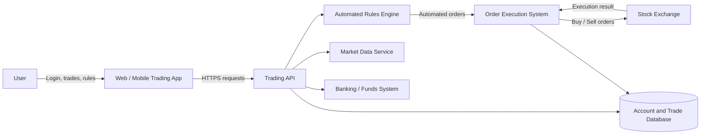
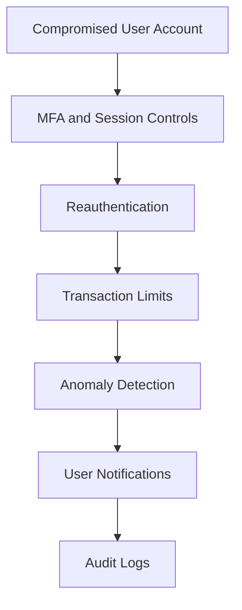

# 1. System Overview

The trading platform allows users to:

- View real-time stock prices
- Execute buy and sell orders
- Transfer funds
- Create automated trading rules

The system requires:

- **99.99% availability**
- **Trade latency below 100 ms**
- Compliance with financial regulations

---

# 2. Most Critical CIA Component

## Integrity

**Integrity is the most critical CIA component** because trading data, account balances, orders, and automated rules must remain accurate and unmodified.

An integrity failure could allow an attacker to:

- Change a buy order into a sell order
- Modify the quantity or price of a trade
- Change an account balance
- Redirect a fund transfer
- Alter an automated trading rule

These actions could cause immediate financial loss and affect market activity.

## CIA Priority

|CIA Component|Importance|
|---|---|
|**Integrity**|Orders, prices, balances, and trading rules must remain accurate|
|**Availability**|The platform must remain accessible during market hours|
|**Confidentiality**|Account, identity, and trading data must remain private|

Availability is also extremely important because outages can prevent users from trading or managing risk. However, executing an incorrect or unauthorized trade may be more damaging than temporarily rejecting a trade.

## Security and Performance Conflict

Security requirements can conflict with performance requirements.

For example:

- Strong validation adds processing time.
- Encryption adds small communication and computation costs.
- Fraud detection may delay an order.
- Detailed logging adds storage and processing overhead.
- Additional authorization checks can increase latency.

Security controls should not simply be removed to achieve the `<100 ms` requirement. Instead, they should be designed efficiently through:

- Fast cryptographic algorithms
- In-memory authorization checks
- Asynchronous logging
- Pre-trade risk checks
- High-performance monitoring
- Load testing under realistic traffic

---

# 3. Threat Model: Automated Trading Rules

## Risk 1: Unauthorized Rule Modification

|Attribute|Details|
|---|---|
|**Threat**|An attacker changes a user's automated trading rule|
|**Attack Scenario**|An attacker steals the user's session and changes a rule from “sell if price falls below €90” to “sell all shares immediately.”|
|**Impact**|Unauthorized trades, financial loss, and loss of customer trust|
|**Likelihood**|High after account or session compromise|
|**Mitigation**|Require MFA or reauthentication before creating or modifying rules. Apply server-side authorization, notify users of rule changes, and allow immediate rule suspension.|

---

## Risk 2: Logic or Validation Flaws

|Attribute|Details|
|---|---|
|**Threat**|An incorrect rule condition creates unintended trades|
|**Attack Scenario**|A rule intended to buy 10 shares is interpreted as buying 10,000 because of a unit-conversion or decimal error.|
|**Impact**|Large financial losses, market exposure, and regulatory issues|
|**Likelihood**|Medium|
|**Mitigation**|Validate rule syntax and values, apply maximum order and position limits, show a clear rule preview, test rules in simulation, and reject impossible or dangerous conditions.|

---

## Risk 3: Race Conditions and Duplicate Execution

|Attribute|Details|
|---|---|
|**Threat**|The same rule executes more than once during rapid price changes|
|**Attack Scenario**|A stock crosses the configured price threshold. Two backend workers process the event at the same time and both submit the same buy order.|
|**Impact**|Duplicate orders, unintended positions, financial loss, and reconciliation problems|
|**Likelihood**|Medium, especially during high market activity|
|**Mitigation**|Use atomic transactions, distributed locks, unique execution IDs, idempotency controls, and database constraints. A rule execution should be recorded before the trade is submitted.|

---

## Risk Summary

|Risk|Likelihood|Impact|Priority|
|---|--:|---|---|
|Unauthorized rule modification|High|Severe financial loss|Critical|
|Logic and validation flaws|Medium|Incorrect or excessive trades|High|
|Duplicate rule execution|Medium|Duplicate orders and losses|High|

---

# 4. Defense in Depth After Account Compromise

If an attacker compromises a user account, security controls should still limit what they can do.

## Layer 1: Strong Authentication and Session Controls

- Require MFA.
- Use short-lived sessions.
- Rotate tokens after login.
- Detect unusual devices and locations.
- Allow users to terminate all sessions.

**Purpose:** Reduce account takeover and shorten the attacker's access period.

---

## Layer 2: Reauthentication for High-Risk Actions

Require the user to authenticate again before:

- Transferring funds
- Adding a bank account
- Changing automated rules
- Increasing transaction limits
- Changing security settings

**Purpose:** A stolen session alone should not authorize the most dangerous actions.

---

## Layer 3: Transaction and Position Limits

Apply:

- Daily transfer limits
- Maximum order values
- Position limits
- Trading-frequency limits
- Limits for newly added bank accounts

**Purpose:** Restrict the maximum financial damage possible from one account.

---

## Layer 4: Anomaly and Fraud Detection

Detect activity such as:

- Login from a new country
- Sudden sale of the entire portfolio
- Unusual automated trading rules
- Rapid transfers after login
- Trading patterns inconsistent with account history

The platform may delay, block, or request additional verification for suspicious activity.

**Purpose:** Identify account misuse even when valid credentials are used.

---

## Layer 5: Notifications and Confirmation

Send immediate notifications for:

- New device logins
- Rule creation or modification
- Large trades
- Fund transfers
- Security-setting changes

Large or unusual actions may require out-of-band confirmation.

**Purpose:** Allow the legitimate user to detect and report abuse quickly.

---

## Layer 6: Secure Authorization

The backend must verify that:

- The account owns the portfolio.
- The user is authorized for the requested action.
- The transaction is within configured limits.
- The destination account is approved.

**Purpose:** Prevent manipulation of account IDs, order IDs, or transfer destinations.

---

## Layer 7: Immutable Audit Trails

Record:

- Login events
- Session changes
- Rule creation and modification
- Trade requests and executions
- Transfers
- Administrative actions

Logs should include timestamps, account IDs, device information, and transaction references.

**Purpose:** Support detection, investigation, dispute resolution, and regulatory review.

---

# 5. Defense-in-Depth Summary

|Layer|Security Control|Damage Limited|
|--:|---|---|
|1|MFA and session protection|Initial account takeover|
|2|Reauthentication|High-risk account actions|
|3|Transaction and position limits|Maximum financial loss|
|4|Anomaly detection|Suspicious valid-user activity|
|5|User notifications|Time before compromise is discovered|
|6|Server-side authorization|Unauthorized account access|
|7|Audit trails|Repudiation and investigation failure|

---

# Conclusion

**Integrity is the most critical CIA component** because unauthorized changes to orders, account balances, or automated rules can cause immediate financial loss.

The main automated-trading risks are:

1. Unauthorized rule modification
2. Logic and validation errors
3. Duplicate execution caused by race conditions

If an account is compromised, defense-in-depth should include:

- MFA and secure sessions
- Reauthentication
- Transaction limits
- Anomaly detection
- User notifications
- Server-side authorization
- Immutable audit trails

These controls reduce the chance that one stolen account can create unlimited financial damage.

---
## References

- SEC, **Regulation Systems Compliance and Integrity**
- FINRA, **Customer Account Takeover Guidance**
- NIST, **Digital Identity Guidelines**
- OWASP, **Transaction Authorization Cheat Sheet**
- OWASP, **Session Management Cheat Sheet**
- OWASP, **Logging Cheat Sheet**
